# Tworzenie aplikacji integracyjnej – ShippingApp

## Czas ćwiczenia

01:00

## Opis ćwiczenia

W tym ćwiczeniu stworzysz aplikację integracyjną „ShippingApp”, która w pierwszej kolejności skieruje komunikat dt. wysyłki towaru w formacie XML od klienta do odpowiedniej usługi obsługującej zgłoszenie w zależności od metody wysyłki, a następnie stransformuje wiadomość do formatu JSON oraz wzbogaci komunikat o informacje dt. transakcji wysyłki. W tym celu wykorzystasz węzeł *Route*, aby odpowiednio przekierować komunikat oraz moduł *Compute* do transformacji danych.

## Cele

Po ukończeniu tego ćwiczenia powinieneś potrafić:
- Użyć węzła *Route* do przekierowania komunikatu.
- Użyć konstruktora wyrażeń XPath, aby zdefiniować wzorzec filtra.
- Utworzyć niestandardowe terminale wyjściowe w węźle *Route*.
- Przetestować przepływ komunikatu z wykorzystaniem narzędzia *Flow exerciser*.
- Stworzyć serwer integracyjny pod node’m integracyjnym.
- Użyć węzła Compute do transformacji wiadomości w formacie XML do formatu JSON z wykorzystaniem języka ESQL.
- Rozumieć składnię skryptów ESQL.
- Przetestować przepływ komunikatu z wykorzystaniem funkcji *Debugger*. 

## Wstęp

Firma logistyczna ma dwa systemy obsługujące przesyłki w zależności od metody wysyłki – *Sea* (wysyłka morska) oraz *Train* (wysyłka lądowa: kolej). Potrzebujemy stworzyć aplikację integracyjną, która przekieruje zamówienie złożone przez klienta do odpowiedniego systemu wysyłkowego. Komunikat zamówienia jest w formacie XML i zawiera następujące informacje: identyfikator użytkowania (`userID`), nazwę użytkownika (`userName`), identyfikator produktu (`prodID`), ilość zamówionego produktu (`quantity`) oraz metodę wysyłki (`shippingMethod`). Przykład komunikatu:

```xml
    <Customer>
        <userName>TestUserSea</userName>
        <prodID>TV001</prodID>
        <quantity>20</quantity>
        <shippingMethod>Sea</shippingMethod>
    </Customer>
```
Schemat XML (`ShippingShemaValidation.xsd`) opisujący komunikat wygląda następująco:

```xml
    <?xml version="1.0" encoding="UTF-8" ?>
    <xs:schema xmlns:xs="http://www.w3.org/2001/XMLSchema">
    <xs:element name="Customer">
    <xs:complexType>
        <xs:sequence>
            <xs:element name="userName" type="xs:string"/>
            <xs:element name="prodID" type="xs:string"/>
            <xs:element name="quantity" type="xs:positiveInteger"/>
            <xs:element name="shippingMethod" type="xs:string"/>
        </xs:sequence>
    </xs:complexType>
    </xs:element>
    </xs:schema>
```
W aplikacji integracyjnej dodasz węzeł *Route* do przepływu komunikatów, dzięki czemu odpowiedzi systemu na wiadomości będą udzielane na podstawie metody wysyłki (`shippingMethod`) zawartej w komunikacie.

W tym ćwiczeniu zdefiniujesz terminale wyjściowe, aby uzyskać kontrolę nad przepływem komunikatów.
- Jeśli wartość `shippingMethod` jest równa *Sea*, komunikat jest kierowany do terminala wyjściowego o nazwie *Sea* do węzła zapytania HTTP o nazwie *Sea*.
- Jeśli wartość `shippingMethod` jest równa *Train*, komunikat jest kierowany do terminala wyjściowego o nazwie *Sea* do węzła zapytania HTTP o nazwie *Train*.
- Jeśli wiadomość jest nieznana, komunikat jest kierowany do węzła o nazwie *Uknown*.
Po odpowiednim skierowaniu komunikatu dostaniemy odpowiedź od systemu wysyłkowego potwierdzającą wykonanie zlecenia.

W następnym kroku stworzymy serwer integracyjny i przetestujemy działanie naszej aplikacji z wykorzystaniem narzędzia *Flow exerciser*.

Dodatkowo klient końcowy naszego komunikatu wysyłki wymaga od nas wiadomości zwrotnej w formacie JSON z dodatkową informacją o ID wysyłki (`shipID`) oraz dacie wykonania wysyłki (`shipTimestamp`). Aby zrealizować wymagania klienta skonfigurujesz węzeł *Compute* wykorzystując skrypt ESQL do transformacji komunikatuów z systemów wysyłkowych.

## Wymagania

- Środowisko warsztatowe z zainstalowanym [IBM App Connect Enterprise Toolkit (ACET)](https://www.ibm.com/docs/en/app-connect/12.0?topic=enterprise-download-ace-developer-edition-get-started).
- Pobrany i rozpakowany folder z plikami potrzebnymi do ćwiczeń laboratoryjnych [labfiles](https://github.com/jawor96/Warsztaty_CP4I/tree/main/labfiles).
- Dostęp do narzędzia do testowania komunikacji (Postman lub SoapUI).

## Przygotowanie środowiska

Na tym etapie uruchomisz aplikację IBM App Connect.

1.	Kliknij w Search w pasku narzędzi i wyszukaj aplikacji IBM App Connect Enterprise Toolkit 12.
2.	Kliknij w aplikację, aby ją uruchomić.

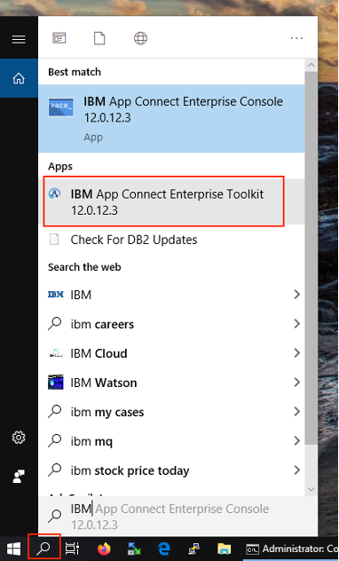

3.	Zostaw domyślny **Workspace**: `<path-to-ACE>\IBM\ACET12\workspace` i kliknij **Launch**. Aplikacja ACET uruchomi się po chwili.

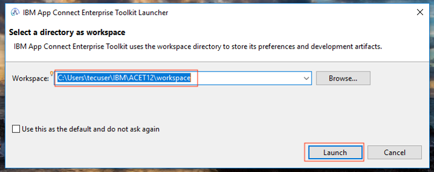

## Tworzenie aplikacji integracyjnej

Na tym etapie stworzysz projekt aplikacji integracyjnej.

1.	Zamknij stronę **Welcome**.

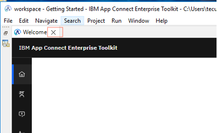

2.	Kliknij **New…** w zakładce *Application Development*, a następnie wybierz **Application**.

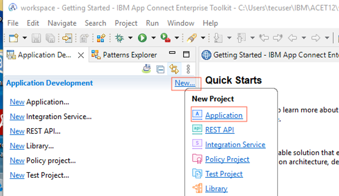

3.	W **Application name** wpisz: `ShippingApp` i kliknij **Finish**.
4.	W aplikacji kliknij **(New…)**, a następnie **Massage Flow**.

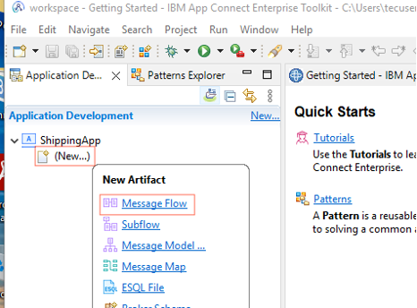

5.	W **Massage flow** name wpisz: `ShippingService`, a następnie **Finish**.

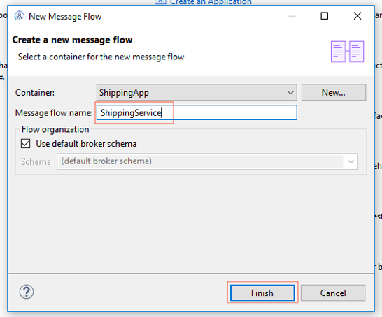

## Skopiowanie potrzebnych plików

Na tym etapie skopiujesz potrzebne do wykonania zadania pliki z folderu `<path-to-labfile>/labfiles`
1.	Przejdź do folderu: `<path-to-labfile>/labfiles`
2.	Zaznacz (wciskając **Ctrl**) następujące pliki:

- ShippingSchemaValidation.xsd
- ShippingRequestAir.xml
- ShippingRequestSea.xml
- ShippingRequestTrain.xml
- UnknownShippingMethod.xsl 

3.	Kliknij prawym przyciskiem myszki i kliknij **Copy**.
4.	Wróć do aplikacji **ACET**, a następnie najedz myszką na aplikacje **ShippingApp**, kliknij prawym przyciskiem myszy, a następnie kliknij **Paste**.

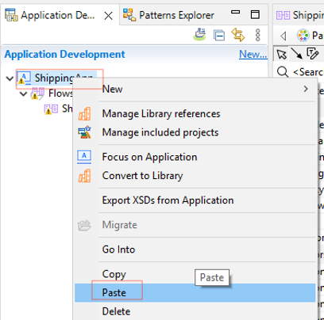

5.	W ten sposób skopiowałeś potrzebne do zadania pliki.

## Dodanie węzłów przepływu wiadomości

Na tym etapie stworzysz wstępny projekt przepływu aplikacji integracyjnej poprzez dodanie potrzebnych węzłów. W zadaniu wykorzystasz następujące węzły:
- [HTTPInput](https://www.ibm.com/docs/en/app-connect/12.0?topic=nodes-httpinput-node) – wykorzystywany do odbioru wiadomości od klienta http w celu przetworzenia wiadomości w dalszej części przepływu. W zadaniu użyty do odbioru wiadomości zamówienia.
- [HTTPRequest](https://www.ibm.com/docs/en/app-connect/12.0?topic=nodes-httprequest-node) – wykorzystywany do interakcji z serwisem webowym. W zadaniu użyty do wywołania usługi wysyłkowej.
- [HTTPReply](https://www.ibm.com/docs/en/app-connect/12.0?topic=nodes-httpreply-node) – wykorzystywany do odpowiedzi z przepływu do klienta http. W zadaniu użyty do otrzymania wiadomości zwrotnej.
- [Route](https://www.ibm.com/docs/en/app-connect/12.0?topic=nodes-Route-node) – wykorzystywany do przekierowania wiadomości spełniające określone kryteria różnymi ścieżkami przepływu. W zadaniu użyty do przekierowania komunikatu do odpowiedniego systemu.
- [XLSTransform](https://translate.google.pl/?]

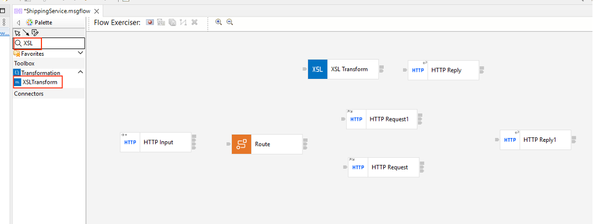

## Konfiguracja węzłów

Na tym etapie skonfigurujesz węzły i dodasz połączenia między poszczególnymi węzłami.

1.	Węzeł **HTTP Input**:
- Kliknij na węzeł i przejdź do zakładki *Basic* w panelu *Properties*.
- W tym miejscu musisz zdefiniować ścieżkę URL, gdzie będzie wysyłał komunikat klienta. W miejscu **Path suffix for URL** wpisz `/shipping`

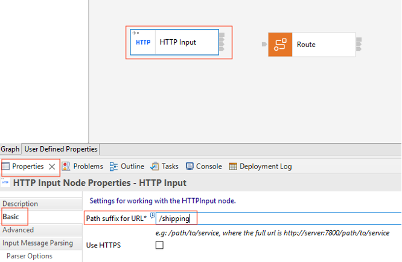

- Następnie przejdź do zakładki *Input Message Parsing* i w *Message domain* wybierz `XMLNSC: For XML messages...`. Dzięki temu węzeł wie jaki jest format otrzymanego komunikatu.

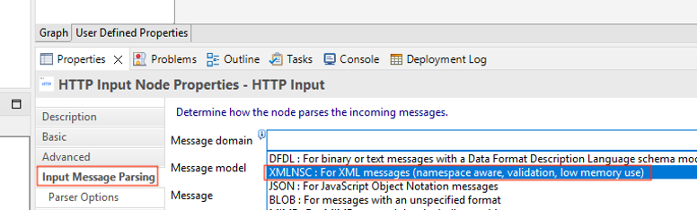

- Połącz terminal **HTTPInput.Out** z terminalem **Route.In**

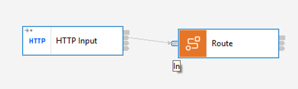

2.	Węzeł *Route*:
- W pierwszej kolejności skonfigurujesz terminale wyjściowe węzła *Route*. Aby dodać terminal należy najechać kursorem na węzeł i kliknąć prawym przyciskiem myszy, a następnie kliknąć **Add Output Terminal**.

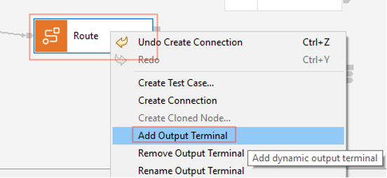

- Wpisz nazwę terminala jako: *Train* i kliknij OK.
- Ponownie kliknij prawym przyciskiem myszy na węzeł i tym razem kliknij **Rename Output Terminal**. 
- Zmień nazwę terminala **Match** na *Sea*.

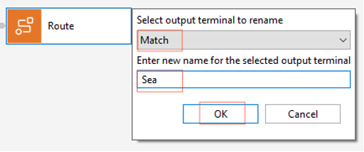

- Kliknij na węzeł i przejdź do zakładki *Basic* w panelu *Properties*.
- Uzupełnisz teraz tabelę filtra, aby skonfigurować terminale wyjścia. Kliknij **Add…**

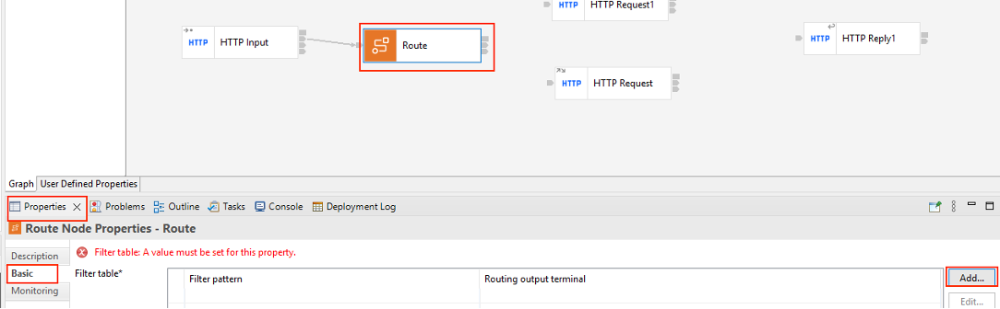

- Wykorzystasz **XPath Expression Builder**, aby skonfigurować wzorzec filtra. Kliknij **Edit…**


- W panelu *Data Types Viewer* rozwiń **$Root**, a następnie kliknij **Add Data Type…**
- Wybierz **Customer**, a następnie kliknij **OK**. W ten sposób dodałeś typ danych komunikatu wejściowego opisanego w pliku `ShippingSchemaValidation.xsd`.

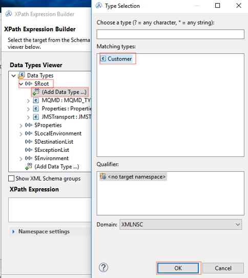

- Rozwiń Customer i dwukrotnie kliknij na `shippingMethod:string`
- Odpowiednia ścieżka pokazała się w **XPath Expression**.
- Aby dopełnić filtr należy dodać warunek. W naszym przypadku wpisz:

    $Root/XMLNSC/Customer/shippingMethod = ‘Sea’

- Kliknij **Finish**.

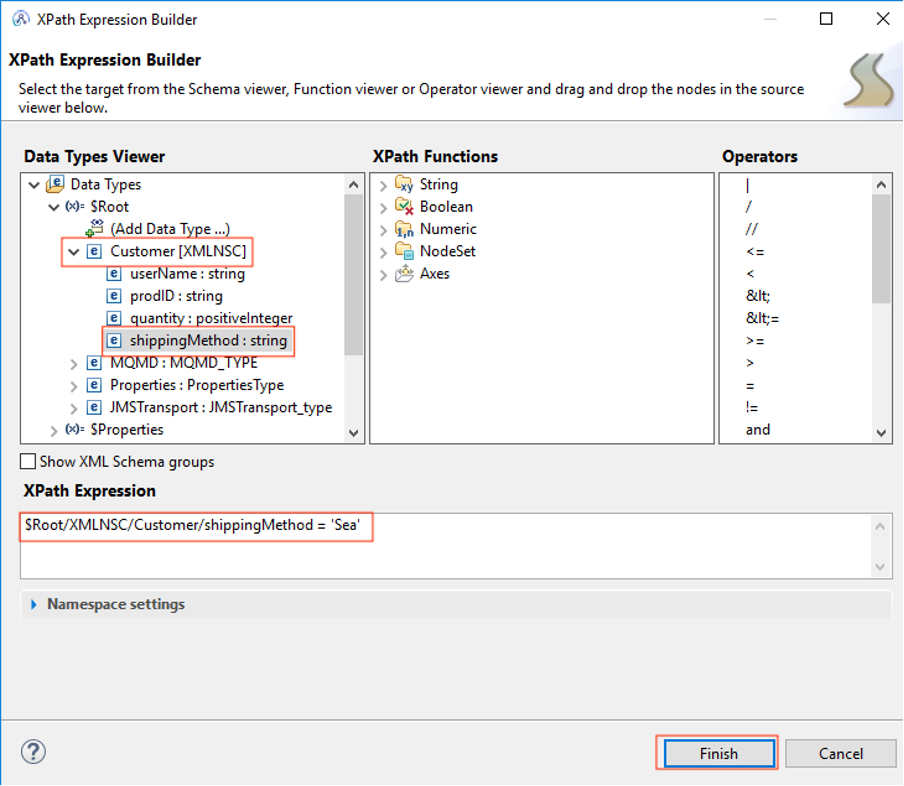

- W **Routing output terminal** wybierz *Sea* i kliknij **OK**.
- Korzystając z tej samej procedury dodaj drugi wzorzec filtra

    $Root/XMLNSC/Customer/shippingMethod = ‘Train’

- Zweryfikuj uzupełnioną tabelę filtrów z załączonym obrazkiem:

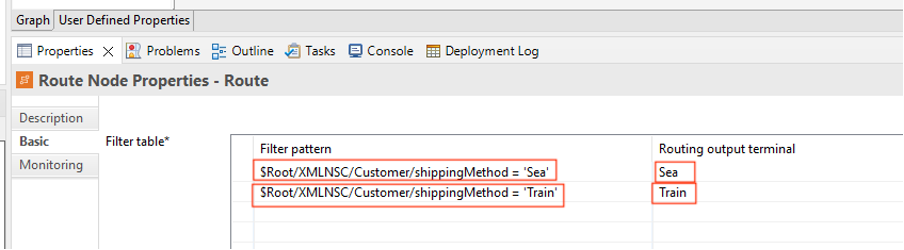

3.	Połączenie węzła *Route*:
- Połącz terminal **Route.Default** z terminalem **XSLTransform.In**
- Połącz terminal **Route.Sea** z terminalem **HTTPRequest.In**
- Połącz terminal **Route.Train** z terminalem **HTTPRequest1.In**

> [!NOTE]
> Wyjście **Route.Default** wykorzystane jest w przypadku, gdy żadna z reguł filtra nie jest spełniona.

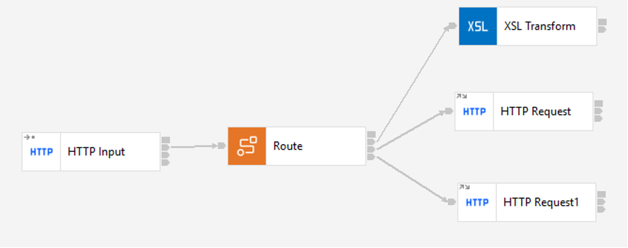

4.	Konfiguracja węzła **XSL Transform**:
- Kliknij na węzeł i przejdź do zakładki *Description* w panelu *Properties*.
- Zmień nazwę węzła na: `Unknown`.

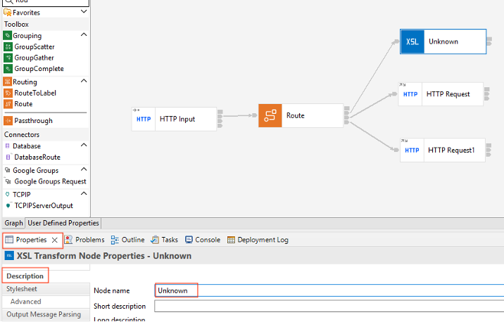

- Następnie przejdź do zakładki *Output Message Parsing* i w *Message domain* wybierz `XMLNSC: For XML messages…`

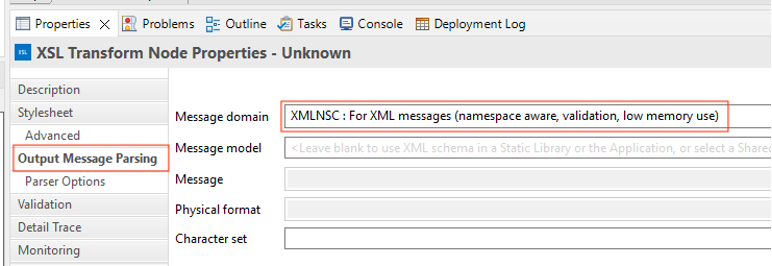

- Przejdź do zakładki *Stylesheet* i kliknij **Browse…**
- Wybierz wcześniej skopiowany plik `UnknownShippingMethod.xsl`, który odpowiada za transformację komunikatu wejściowego na komunikat wyjściowy z wiadomością o nieznanej metodzie wysyłki.

> [!NOTE]
> Transformacja wstawia do wiadomość: `UNKNOWN Shipping Method` w polu `shippingStatus`.

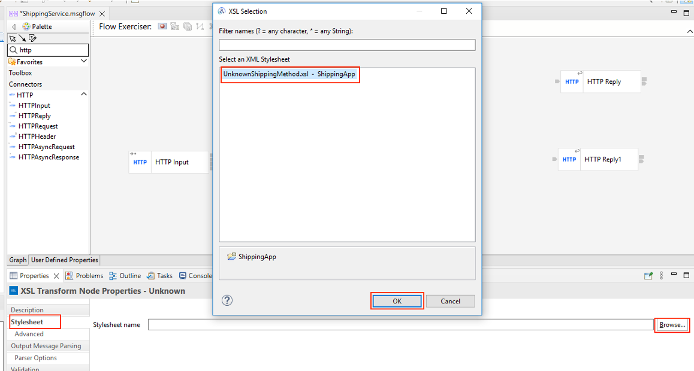

- Połącz terminal **Unknown.Out** z terminalem **HTTPReply1.In**

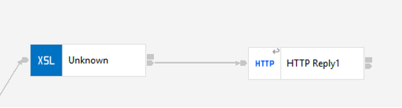

5.	Konfiguracja węzła **HTTP Request**:
- Kliknij na węzeł i przejść do zakładki *Description* w panelu *Properties*.
- Zmień nazwę węzła na: `Sea`

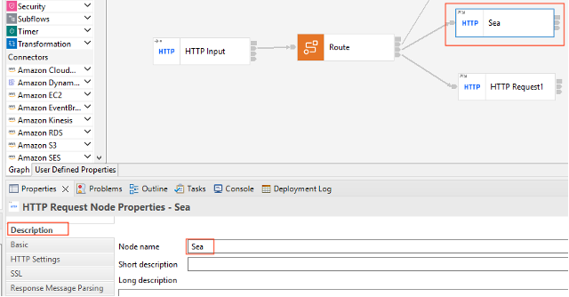

- Przejść do zakładki *Basic* w panelu *Properties*.
- W **Web service URL** wpisz adres usługi webowej: `http://dp-api-traffic-3000-lab-mj.apps.cp4i.team.waw.pl/shipping`, która zwraca nam pozytywny status wykonania zlecenia.

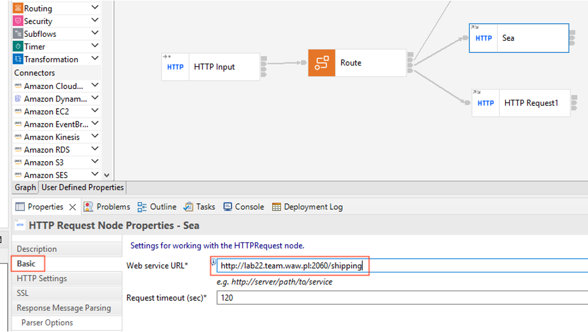

- Następnie przejdź do zakładki *Response Message Parsing* i w *Message domain* wybierz `XMLNSC: For XML messages...`

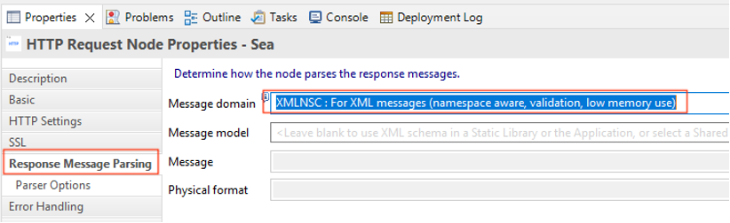

- Połącz terminal **Sea.Out** z terminalem **HTTPReply.In**

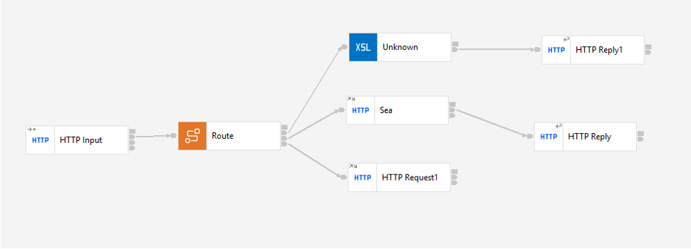

6.	Konfiguracja węzła **HTTP Request1**:
- Kliknij na węzeł i przejdź do zakładki *Description* w panelu *Properties*.
- Zmień nazwę węzła na: `Train`
- Przejdź do zakładki *Basic* w panelu *Properties*.
- W **Web service URL** wpisz adres usługi webowej: `http://dp-api-traffic-3001-lab-mj.apps.cp4i.team.waw.pl/shipping`, która zwraca nam pozytywny status wykonania zlecenia.

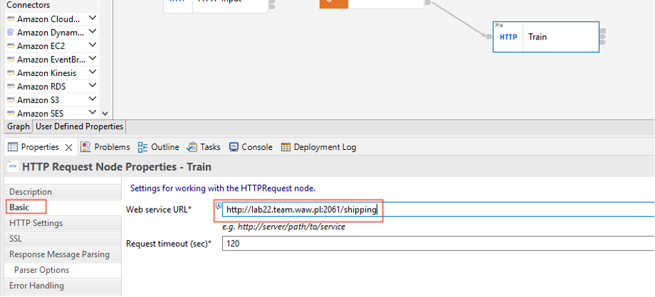

- Następnie przejdź do zakładki *Response Message Parsing* i w *Message domain* wybierz `XMLNSC: For XML messages...`
- Połącz terminal **Train.Out** z terminalem **HTTPReply.In**

7.	Węzły HTTP Reply1 oraz HTTP Reply nie potrzebują dodatkowej konfiguracji.
8.	Zapisz skonfigurowany przepływ klikając **CTRL+S**.
9.	Połączenia powinny wyglądać jak na załączonym obrazku:

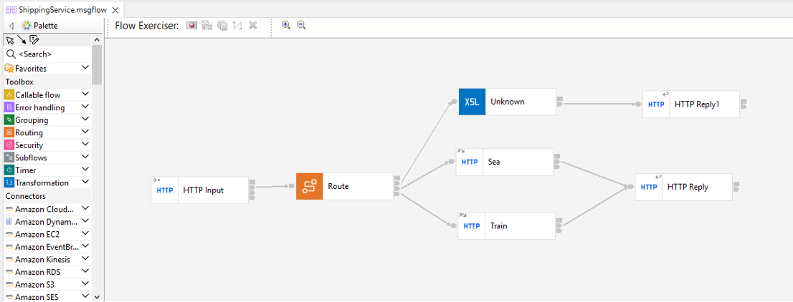

10.	Połączenia można również sprawdzić w zakładce **Outline**.

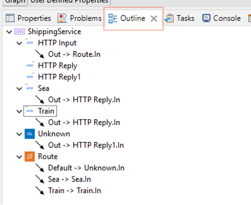

## Tworzenie serwera integracyjnego

Na tym etapie stworzysz nowy serwer integracyjny z poziomu IBM App Connect Enterprise Console.

> [!NOTE]
> **Integration Node (IN)** to kontener zarządzający wieloma Integration Serverami. 
> **Integration Server (IS)** to serwer wykonawczy, który uruchamia i obsługuje Twoje przepływy integracyjne (message flows).

1.	Aby uruchomić konsolę ACE, kliknij w *Search* w pasku narzędzi i wpisz `App Connect`, a następnie kliknij prawym przyciskiem myszy na aplikację **IBM App Connect Enterprise Console** i kliknij **Run as administrator**.

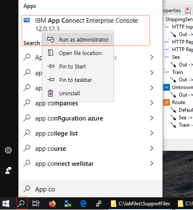

2.	Po zaakceptowaniu uprawnień administracyjnych pojawi się nam konsola ACE 12/13.
3.	Aby stworzyć nowy Integration Node wpisz komendę i kliknij Enter:

    `mqsicreatebroker WORKNODE`

4.	Aby wystartować Integration Node wpisz komendę i kliknij Enter:

    `mqsistart WORKNODE`

5.	Poczekaj aż WORKNODE wystartuje i stwórz Integration Server pod WORKNODE wykonując komendę:

    `mqsicreateexecutiongroup WORKNODE -e IntServer`

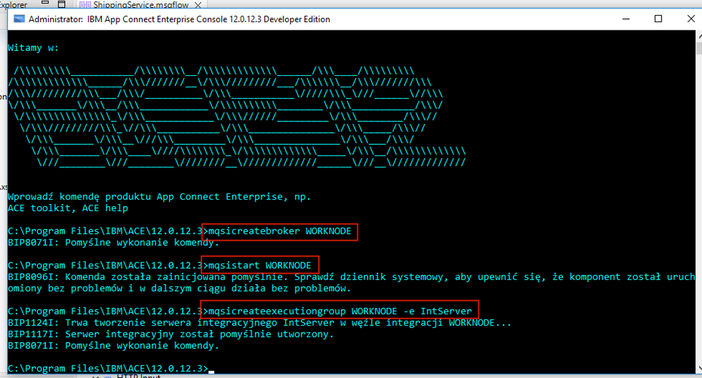

6.	Po komunikacie o pomyślnym wystartowaniu serwera integracyjnego wróć do aplikacji IBM App Connect Enterprise Toolkit.
7.	Upewnij się, że serwer integracyjny **IntServer** działa, klikając prawym przyciskiem myszy na węzeł integracyjny **WORKNODE** (lewy dolny róg aplikacji) i **Refresh**.

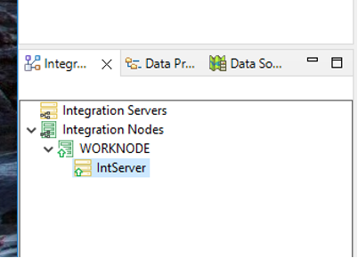

## Testowanie aplikacji integracyjnej ShippingApp z wykorzystaniem Flow Exerciser

W tej części ćwiczenia przetestujesz naszą aplikację integracyjną. W tym celu wykorzystasz wbudowane narzędzie ACET do testowania przepływów – **Flow Exerciser**. Podczas testów wykorzystasz trzy przykładowe komunikaty, które skopiowałeś do projektu aplikacji na początku ćwiczenia. Komunikaty mają ustawione różne metody wysyłki (`shippingMethod`), abyś mógł przetestować wszystkie warianty odpowiedzi.

1.	Kliknij ikonę **Start flow exerciser** w (lewym górnym rogu okna przepływu), aby uruchomić **Flow Exerciser**, który stworzy plik BAR naszej aplikacji oraz wdroży ją na serwerze aplikacyjnym.

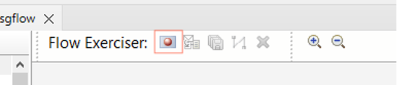

2.	Wybierz serwer integracyjny **IntServer** i kliknij **Finish**.
3.	Kliknij OK, aby potwierdzić komunikat.
4.	Po paru sekundach pojawi się okno potwierdzające, że **Flow Exerciser** jest gotowy do nagrywania przepływu. Kliknij **Close**.
5.	Aby przetestować pierwszy komunikat z metodą wysyłki `Sea`:

- Kliknij ikonę **Send a message to flow** w pasku narzędzi **Flow Exerciser**.

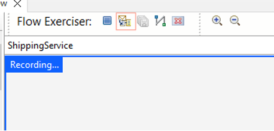

- W oknie **Send Message** kliknij **New Message**.
- W polu **Name** wpisz: `Sea`
- Zaznacz **Import from file** i kliknij **Workspace…**
- Przejdź do `ShippingApp` i kliknij `ShippingRequestSea.xml`, a następnie **OK**.

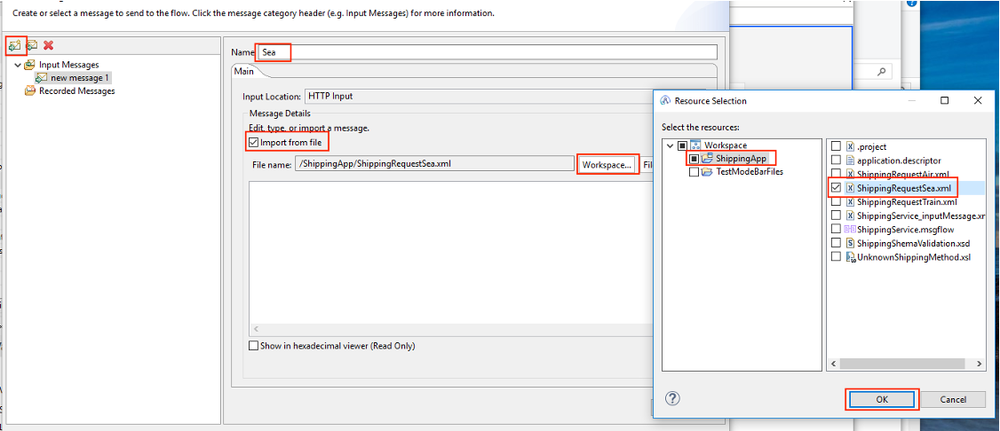

- Komunikat został zaimportowany. Kliknij **Send**.

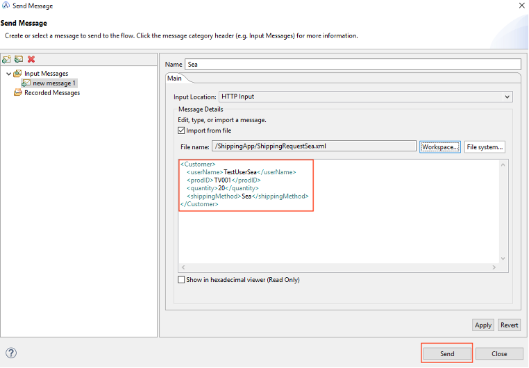

- Okno **Progress Information** pokazuje, że wiadomość została wysłana do **HTTP Input**. Kiedy test się zakończy pokaże się **Stopped**. Kliknij **Close**.

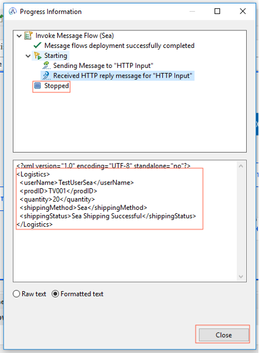

- Ścieżka komunikatu jest podświetlona w przepływie wiadomości.

Dla tego testu wiadomość została przekierowana do systemu wysyłkowego **Sea**.

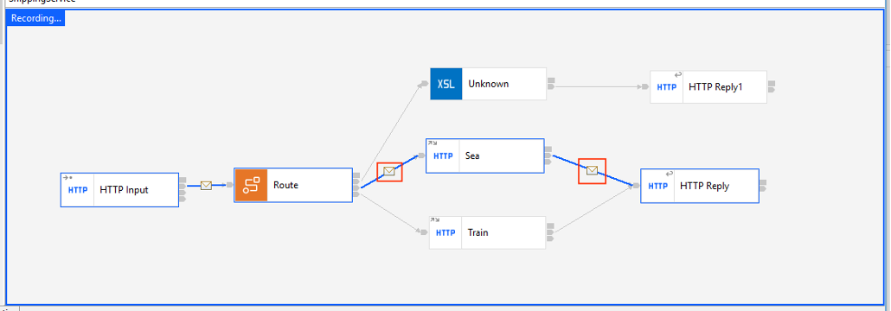

- Zweryfikuj `shippingStatus` w komunikatach testowych.

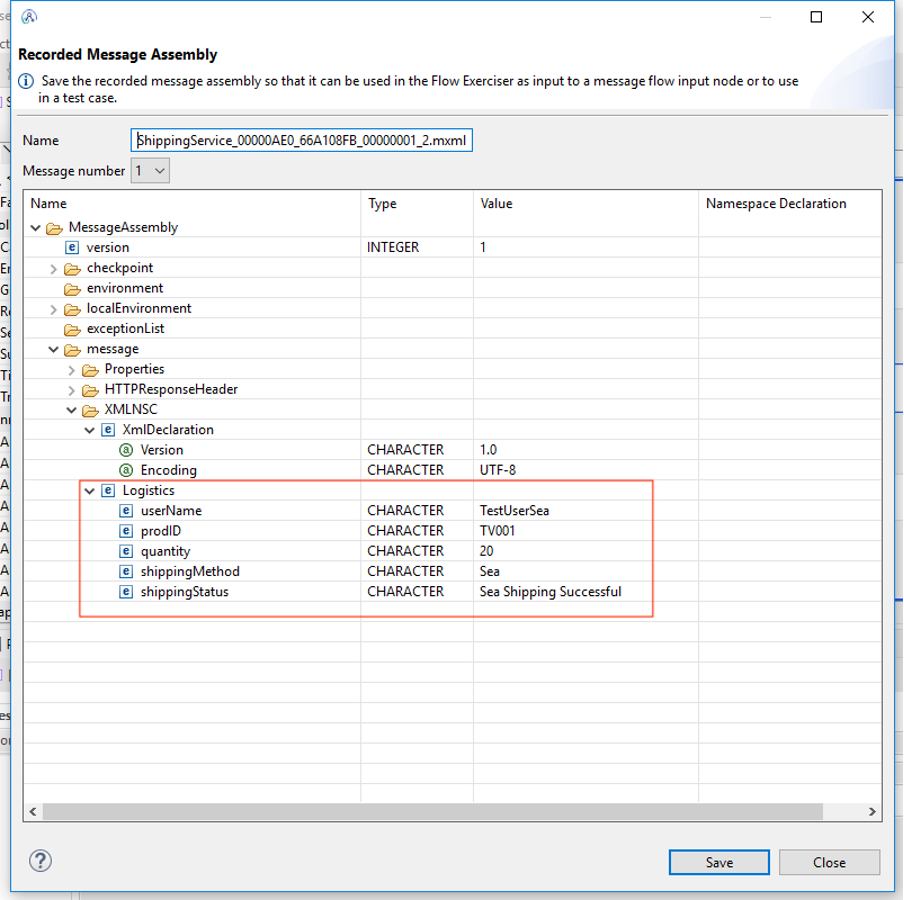

- Zamknij **Recorded Message Assembly**.
- Sprawdź odpowiedź systemu po przetworzeniu komunikatu.
- Zamknij okno.

6.	Wykonaj podobną procedurę dla komunikatu `Train`. Ścieżka komunikatu powinna przechodzić przez system wysyłkowy `Train`.

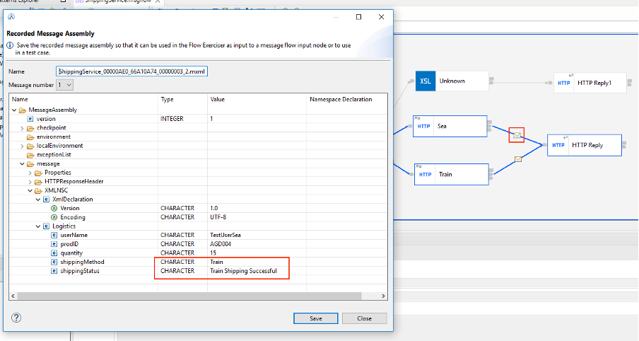

7.	Następnie wykonaj podobną procedurę dla komunikatu `Air`. W tym przypadku wiadomość zostanie przekierowana do transformaty **Unknown** i otrzymamy komunikat o nieznanej metodzie wysyłki.

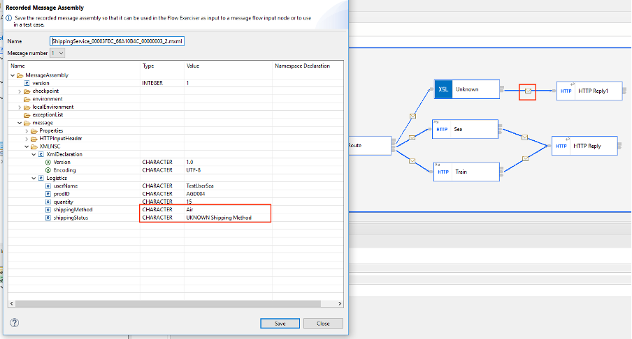

8.	Tym sposobem przetestowałeś wszystkie skonfigurowane scenariusze naszej aplikacji. Aby zatrzymać **Flow Exerciser** kliknij **Stop recording** w pasku narzędzi.

## Transformacja komunikatu z formatu XML na JSON wykorzystując węzeł Compute - Wstęp

W tej części ćwiczenia będziesz transformować komunikat otrzymany z systemu wysyłkowego w formacie XML do komunikatu dla klienta w formacie JSON. Przy okazji wzbogacisz komunikat o dwie informacje dt. ID wysyłki oraz daty wykonania wysyłki.
Przykładowy komunikat zwrotny z systemu wysyłkowego wygląda następująco:

```xml
    <?xml version="1.0" encoding="UTF-8"?>
    <Logistics>
        <userName>TestUserSea</userName>
        <prodID>AGD004</prodID>
        <quantity>15</quantity>
        <shippingMethod>Train</shippingMethod>
        <shippingStatus>Train Shipping Successful</shippingStatus>
    </Logistics>
```

Naszym zadaniem jest transformacja komunikatu do następującego formatu JSON:

```json
    {
        "Customer": {
            "userName": "TestUserSea",
            "prodID": "AGD004",
            "quantity": 15,
            "shippingMethod": "Train",
            "shippingStatus": "Train Shipping Successful",
            "shipID": 20240712131920977185,
            "shipTimestamp": "2024-07-12 13:19:20.977185"
        }
    }
```

Dodane zostały pola `shipID` oraz `shipTimestamp`. Operację transformacji wykonasz wykorzystując skrypt napisany w języku ESQL działający w węźle **Compute**. W zadaniu wykorzystasz następujące instrukcje i funkcje ESQL:

Polecenia ESQL:

- [CREATE LASTCHILD OF …. DOMAIN](https://www.ibm.com/docs/en/app-connect/12.0?topic=statements-create-statement) – polecenie, które zamienia format ostatecznego stanu istniejącego pola.
- [CREATE FIELD](https://www.ibm.com/docs/en/app-connect/12.0?topic=statements-create-statement) – polecenie definiująca nowe pole.
- [DECLARE … REFERENCE TO …](https://www.ibm.com/docs/en/app-connect/12.0?topic=statements-declare-statement) - polecenie definiuje zmienną jako odniesienie do innego pola.
- [SET](https://www.ibm.com/docs/en/app-connect/12.0?topic=statements-set-statement) – polecenie przypisuje wartość zmiennej.

Funkcje ESQL:

- [CAST](https://www.ibm.com/docs/en/app-connect/12.0?topic=functions-cast-function) - funkcja, która przekształca jedną lub więcej wartości z jednego typu danych na inny.
- [CURRENT_TIMESTAMP](https://www.ibm.com/docs/en/app-connect/12.0?topic=functions-current-timestamp-function) - funkcja zwraca aktualną datę i czas lokalny w formacie ISO8601.

## Dodanie węzła Compute do przepływu

1.	Rozwiń aplikację **ShippingApp** i kliknij **ShippingService.msgflow**
2.	Należy dodać węzeł **Compute** między węzłami **Sea** oraz **Train**, a węzłem HTTP Reply. Aby to zrobić w pierwszej kolejności usuń połączenia między węzłami **Sea** oraz **Train** oraz **HTTP Reply**, klikając prawym przyciskiem myszy na połączenie i **Delete**.

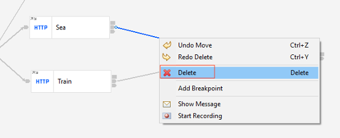

3.	W zakładce *Palette* w komórce `<Search>` wpisz `Compute`. Pojawią się węzły związane z przetwarzaniem komunikatów.
4.	Dodaj węzeł **Compute** tak jak na załączonym obrazku:

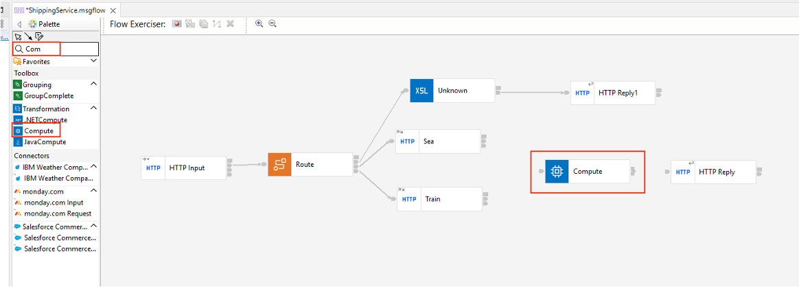

5.	Połącz odpowiednie węzły:

- Połącz terminal **Sea.Out** z terminalem **Compute.In**
- Połącz terminal **Train.Out** z terminalem **Compute.In**
- Połącz terminal **Compute.Out** z terminalem **HTTPReply.In**

## Konfiguracja węzła Compute

1.	Kliknij na węzeł i przejdź do zakładki *Description* w panelu *Properties*.
2.	W **Node name** wpisz `XML2JSON`

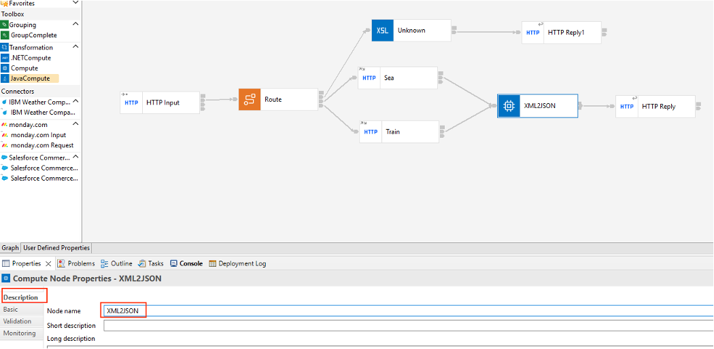

3.	Kliknij dwukrotnie na węzeł `XML2JSON`, aby otworzyć skrypt ESQL. W nowym oknie otworzy się standardowy skrypt.
4.	Zaznacz cały domyślny skrypt klikając **Ctrl+A** i usuń go.
5.	W puste miejsce wklej następujące komendy:

```sql
    CREATE COMPUTE MODULE ShippingService_XML2JSON
        CREATE FUNCTION Main() RETURNS BOOLEAN
        BEGIN
            -- Dodaj swój komentarz
            CREATE LASTCHILD OF OutputRoot DOMAIN('JSON');
            CREATE FIELD OutputRoot.JSON.Data;
            DECLARE outRef REFERENCE TO OutputRoot.JSON.Data;
            CREATE FIELD outRef.Customer;
            DECLARE inRef REFERENCE TO InputRoot.XMLNSC.Logistics;
            
            -- Dodaj swój komentarz
            DECLARE string_id CHARACTER;
            DECLARE int_id INTEGER;
            SET string_id = CAST(CURRENT_TIMESTAMP AS CHARACTER FORMAT 'yyyyMMddHHmmssSSSSSS');
            SET int_id = CAST(string_id AS INTEGER);
            
            -- Dodaj swój komentarz
            SET outRef.Customer.userName = inRef.userName;
            SET outRef.Customer.prodID = inRef.prodID;
            SET outRef.Customer.quantity = CAST(inRef.quantity AS INTEGER);
            -- miejsce na Twoją linię kodu: Ustaw pole shippingMethod
            -- miejsce na Twój linię kodu: Ustaw pole shippingStatus
            SET outRef.Customer.shipID = int_id;
            SET outRef.Customer.shipTimestamp = CURRENT_TIMESTAMP;  
        END;
    END MODULE;
```

6.	Przeanalizuj powyższy skrypt ESQL i uzupełnij:

- Komentarze opisujące poszczególne fragmenty skryptu.
- Dwie linijki kodu zgodnie z instrukcją w komentarzu.

7.	Sprawdź uzupełniony skrypt z przykładowymi komentarzami w `<path-to-libfiles>\ShippingService_XML2JSON.esql` lub ze wzorem na końcu instrukcji.
8.	Zapisz skrypt ESQL i wróć do zakładki **ShippingService.msgflow**.
9.	Kliknij na węzeł **XML2JSON** i przejść do zakładki *Basic* w panelu Properties.
10.	 W polu **ESQL module** kliknij **Browse…** i wybierz `{default}:ShippingService_XML2JSON`, a następnie kliknij **OK**. W ten sposób zdefiniowałeś moduł ESQL, z którego korzysta węzeł Compute.

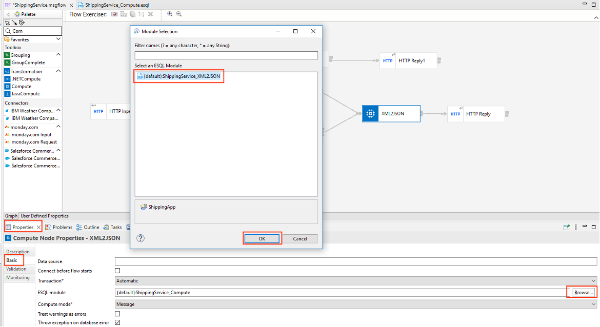

11.	Zapisz przepływ.

## Testowanie przepływu z wykorzystaniem funkcji Debugger

W tym ćwiczeniu skonfigurujesz port, na którym będzie uruchamiał się **Debugger**, dodasz *Brakepoint’y* w których będziesz sprawdzać stan komunikatu podczas debugging’u, a następnie przetestujesz przepływ wykorzystując narzędzie Postman. **Debugger** podobnie jak **Flow Exerciser** służy do prześledzenia komunikatu w ramach przepływu i może pomóc w wyszukiwaniu i zrozumieniu ewentualnych błędów.

1.	W przeciwieństwie do **Flow Exercisera**, uruchamiając **Debugger** nie wykonuje się ponowne wdrożenie aplikacji na serwer integracyjny, dlatego po zapisaniu zmian należy wdrożyć aplikacje ręcznie. Kliknij prawym przyciskiem myszy na ShippingApp i kliknij **Deploy…**, a następnie wybierz **IntServer** i kliknij **Finish**.
 
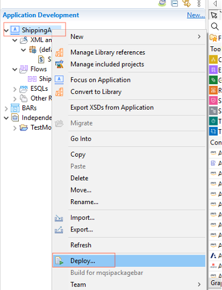

2.	Zanim skonfigurujesz **Debugger**, dodaj *Brakepoint’y*. Wróć do zakładki **ShippingService.msgflow** i kliknij **Ctrl+A**, aby zaznaczyć wszystkie elementy przepływu, a następnie najdź kursorem na dowolny element przepływu i kliknij prawym przyciskiem myszy i kliknij **Add Breakpoint**.
 
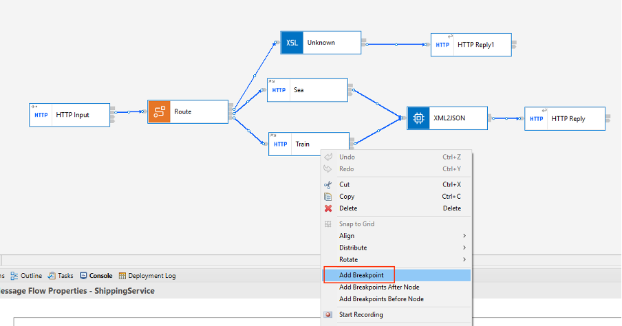

3.	Do testowania przepływu wykorzystasz narzędzie **Postman**. Zanim przejdziesz do aplikacji sprawdź port `http` na którym nasłuchuje serwer integracyjny.
4.	Aby sprawdzić port `<HTTP_Port_IntServer>`, na którym nasłuchuje serwer integracyjny kliknij na **IntServer** w **Integration Explorer** i sprawdź **HTTP Listener port** w *Properties*.
 
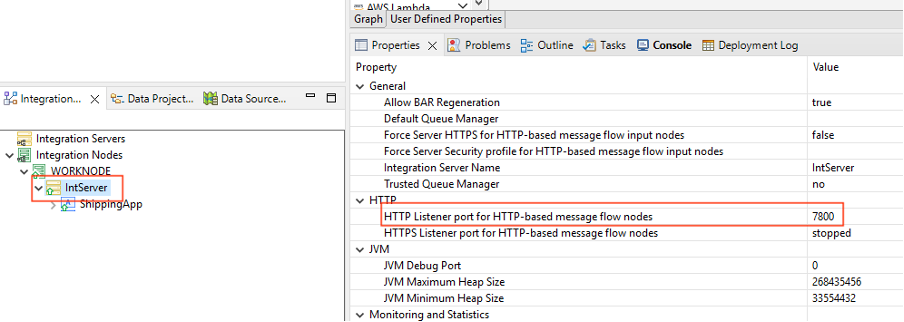

5.	Uruchom aplikację **Postman** i dodaj nowe zapytanie klikając znak „**+**”. Wprowadź następujące dane:

- Request Type: `POST`
- URL: `http://localhost:<HTTP_Port_IntServer>/shipping`
- Body: `(raw) XML`
    <Customer>
        <userName>TestUserSea</userName>
        <prodID>TV001</prodID>
        <quantity>20</quantity>
        <shippingMethod>Sea</shippingMethod>
    </Customer>
 
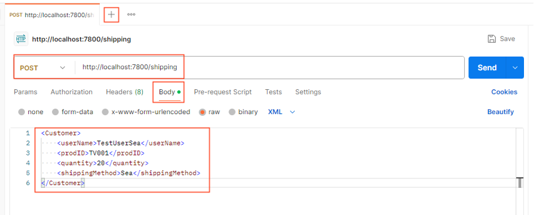

6.	Nie uruchamiaj jeszcze zapytania i wróć do ACET.
7.	Teraz przejdziesz do konfiguracji i uruchomienia **Debuggera**. Kliknij prawym przyciskiem myszy na **IntServer** w **Integration Explorer**, a następnie **Lauch Debugger**.
 
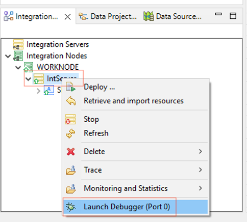

8.	W oknie **Launch Debugger** kliknij **Configure…**
9.	Wpisz port `9998`, a następnie **OK**. Zaczekaj, aż serwer integracyjny się zrestartuje i kliknij **OK**.
10.	**Debugger** jest uruchomiony, przejdź teraz do widoku **Debuggera**. Aby to zrobić kliknij na pasku zakładek **Window --> Perspective --> Open Perspective --> Debug** klikając w prawym górnym rogu na ikonę **Debug**.

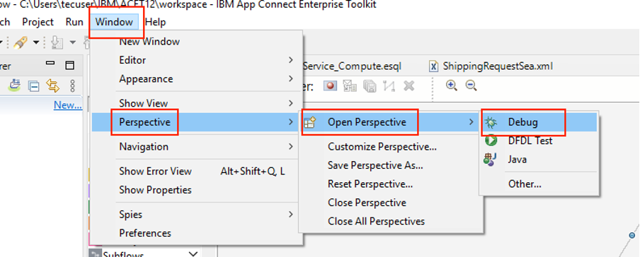

11.	Wróć do aplikacji **Postman** i kliknij **Send**.
12.	Wróć do ACET. Widać, że wiadomość zatrzymała się na pierwszym *Breakpoint*. Możesz sprawdzić zawartość komunikatu, rozwijając poszczególne komponenty w zakładce **Variables**.

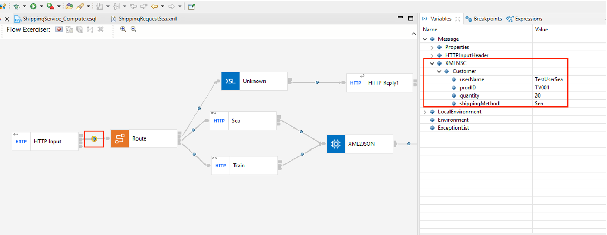

13.	Aby przejść dalej kliknij ikonę **Step Over**. Przeanalizuj, jak zmieniają się pola komunikatu w zakładce **Variables**.

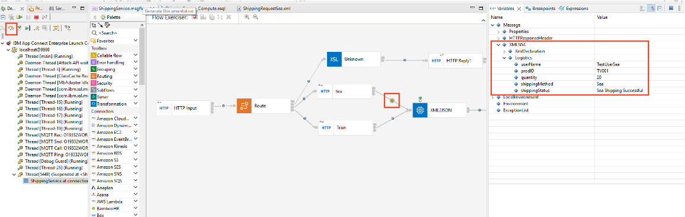

14.	Przed węzłem **Compute** kliknij ikonę **Step into Source**, aby prześledzić zmiany podczas wykonywania kodu skryptu. Klikaj **Step Over**, aby analizować kod linijka po linijce.

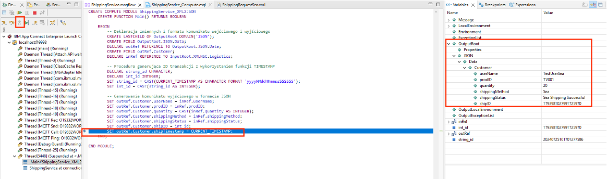

15.	Klikaj **Step Over** do końca przepływu, aby zakończyć *Debbuging*.
16.	Po zakończeniu przepływu wróć do aplikacji **Postman** i sprawdź wiadomość zwrotną z systemu.
 
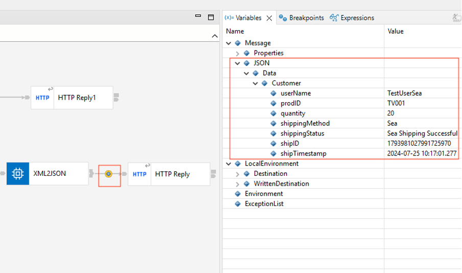

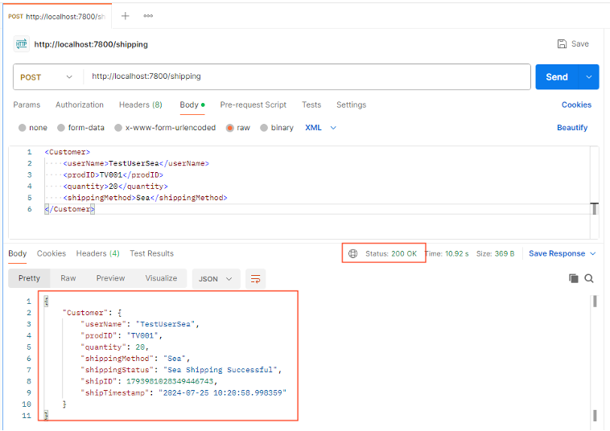

17.	(Opcjonalnie) Możesz powtórzyć test zmieniając parametr `shippingMethod` na `Train`.
18.	Wróć do ACET i kliknij na ikonę **Integration Development**, aby zmienić widok.

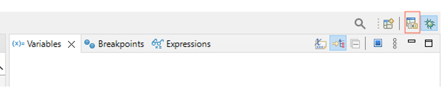
 
19.	Kliknij prawym przyciskiem myszy na **IntServer** i kliknij **Terminate Debugger**, aby zatrzymać **Debugger**.

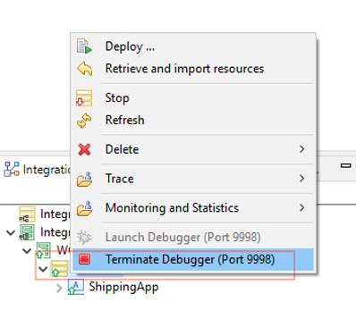
 
> [!NOTE]
> Jeśli w narzędziu **Postman** otrzymasz komunikat błędu o zbyt długim przetwarzaniu komunikatu, zresetuj sesję **Debugger** i wyślij komunikat ponownie.

***KONIEC ĆWICZENIA - Gratulacje!***

## Podsumowanie

Podczas wykonywania ćwiczenia dowiedziałeś się jak tworzy się aplikację integracyjną w narzędziu IBM App Connect Enterprise Toolkit. Stworzyłeś przepływ integracyjny zawierający różne węzły integracyjne. Wykorzystałeś węzeł *Route*, aby przekierować komunikat w formacie XML w oparciu o wzorce filtra. Wykorzystałeś węzeł XML Transform, aby obsłużyć komunikat nie pasujący do wzorca. Użyłeś węzłów HTTP Request, aby odwołać się do zewnętrznych systemów web. Stworzyłeś serwer integracyjny, oraz przetestowałeś przepływ integracyjny z wykorzystaniem narzędzia Flow Exerciser. Dowiedziałeś się jak wykorzystać węzeł Compute do transformacji komunikatu z formatu XML do formatu JSON. Przetestowałeś przepływ komunikatu z wykorzystaniem narzędzia Debugger. Dodatkowo zrozumiałeś składnię języka ESQL oraz cześć funkcji wykorzystywanych do pisania skryptów.

## Skrypty

```sql
    CREATE COMPUTE MODULE ShippingService_XML2JSON
        CREATE FUNCTION Main() RETURNS BOOLEAN
        
        BEGIN
            -- Deklaracja zmiennych i formatu komunikatu wejściowego i wyjściowego
            CREATE LASTCHILD OF OutputRoot DOMAIN('JSON');
            CREATE FIELD OutputRoot.JSON.Data;
            DECLARE outRef REFERENCE TO OutputRoot.JSON.Data;
            CREATE FIELD outRef.Customer;
            DECLARE inRef REFERENCE TO InputRoot.XMLNSC.Logistics;
            
            -- Procedura generująca ID transakcji z wykorzystaniem funkcji TIMESTAMP
            DECLARE string_id CHARACTER;
            DECLARE int_id INTEGER;
            SET string_id = CAST(CURRENT_TIMESTAMP AS CHARACTER FORMAT 'yyyyMMddHHmmssSSSSSS');
            SET int_id = CAST(string_id AS INTEGER);
            
            -- Generowanie komunikatu wyjściowego w formacie JSON
            SET outRef.Customer.userName = inRef.userName;
            SET outRef.Customer.prodID = inRef.prodID;
            SET outRef.Customer.quantity = CAST(inRef.quantity AS INTEGER);
            SET outRef.Customer.shippingMethod = inRef.shippingMethod;
            SET outRef.Customer.shippingStatus = inRef.shippingStatus;
            SET outRef.Customer.shipID = int_id;
            SET outRef.Customer.shipTimestamp = CURRENT_TIMESTAMP;      
        END;
        
    END MODULE;
```