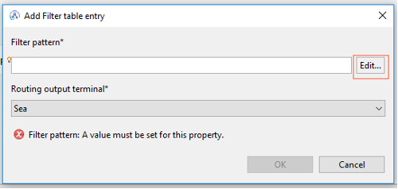

# Tworzenie aplikacji integracyjnej – ShippingApp

## Czas ćwiczenia

01:00

## Opis ćwiczenia

W tym ćwiczeniu stworzysz aplikacje integracyjną „ShippingApp”, która skieruje komunikat dt. wysyłki towaru w formacie XML od klienta do odpowiedniej usługi obsługującej zgłoszenie w zależności od metody wysyłki. W tym celu wykorzystasz węzeł Route, aby odpowiednio przekierować komunikat.

## Cele

Po ukończeniu tego ćwiczenia powinieneś potrafić:
•	Użyć węzła Route do przekierowania komunikatu.
•	Użyć Konstruktora wyrażeń XPath, aby zdefiniować wzorzec filtra.
•	Utworzyć niestandardowe terminale wyjściowe w węźle Route.
•	Przetestować przepływ komunikatu z wykorzystaniem narzędzia Flow exerciser.
•	Stworzyć serwer integracyjny pod node’m integracyjnym.

## Wstęp

Firma logistyczna ma dwa systemy obsługujące przesyłki w zależności od metody wysyłki – Sea (wysyłka morska) oraz Train (wysyłka lądowa: kolej). Potrzebujemy stworzyć aplikacje integracyjną, która przekieruje zamówienie złożone przez klienta do odpowiedniego systemu wysyłkowego. Komunikat zamówienia jest w formacie XML i zawiera następujące informacje: identyfikator użytkowania (userID), nazwa użytkowania (userName), identyfikator produktu (prodID), ilość zamówionego produktu (quantity) oraz metodę wysyłki (shippingMethod). Przykład komunikatu:

    <Customer>
        <userName>TestUserSea</userName>
        <prodID>TV001</prodID>
        <quantity>20</quantity>
        <shippingMethod>Sea</shippingMethod>
    </Customer>

Schemat XML (ShippingShemaValidation.xsd) opisujący komunikat wygląda następująco:

    <?xml version="1.0" encoding="UTF-8" ?>
    <xs:schema xmlns:xs="http://www.w3.org/2001/XMLSchema">
    <xs:element name="Customer">
    <xs:complexType>
        <xs:sequence>
            <xs:element name="userName" type="xs:string"/>
        <xs:element name="prodID" type="xs:string"/>
        <xs:element name="quantity" type="xs:positiveInteger"/>
        <xs:element name="shippingMethod" type="xs:string"/>
        </xs:sequence>
    </xs:complexType>
    </xs:element>
    </xs:schema>

W aplikacji integracyjnej dodasz węzeł Route do przepływu komunikatu, dzięki czemu odpowiedzi systemu na wiadomość będą udzielane na podstawie metody wysyłki (shippingMethod) w komunikacie.

W tym ćwiczeniu zdefiniujesz terminale wyjściowe, aby uzyskać kontrolę nad przepływem komunikatów.
•	Jeśli wartość shippingMethod będzie równa Sea, komunikat jest kierowany do terminala wyjściowego o nazwie Sea do węzła zapytania HTTP o nazwie Sea.
•	Jeśli wartość shippingMethod będzie równa Train, komunikat jest kierowany do terminala wyjściowego o nazwie Sea do węzła zapytania HTTP o nazwie Train.
•	Jeśli wiadomość jest nieznana, komunikat jest kierowana do węzła o nazwie Uknown.
Po odpowiednim skierowaniu komunikatu dostaniemy odpowiedź od systemu wysyłkowego potwierdzająca wykonanie zlecenia.

W następnym kroku stworzymy serwer integracyjny i przetestujemy działanie naszej aplikacji z wykorzystaniem narzędzia Flow exerciser.

## Wymagania

•	Środowisko warsztatowe z zainstalowanym IBM App Connect Enterprise Toolkit (ACET).
•	Dostęp do plików ćwiczeń laboratoryjnych C:\labfiles\Lab2

## Przygotowanie środowiska

Na tym etapie uruchomisz aplikacje IBM App Connect.
1.	Kliknij w Search w pasku narzędzi i wyszukaj aplikacji IBM App Connect Enterprise Toolkit 12.
2.	Kliknij w aplikacje, aby ją uruchomić.

3.	Zostaw domyślny Workspace: C:\Users\tecuser\IBM\ACET12\workspace i kliknij Launch. Aplikacja ACET uruchomi się po chwili.

Tworzenie aplikacji integracyjnej
Na tym etapie stworzysz projekt aplikacji integracyjnej.
1.	Zamknij stronę Welcome.

2.	Kliknij New… w zakładce Application Development, a następnie wybierz Application.

3.	W Application name wpisz: ShippingApp i kliknij Finish.
4.	W aplikacji kliknij (New…), a następnie Massage Flow.

5.	W Massage flow name wpisz: ShippingService, a następnie Finish.
 
Skopiowanie potrzebnych plików
Na tym etapie skopiujesz potrzebne do wykonania zadania pliki z folderu C:\labfiles\Lab2
1.	Przejdź do folderu: C:\labfiles\Lab2
2.	Zaznacz (wciskając Ctrl) następujące pliki:
a.	ShippingSchemaValidation.xsd
b.	ShippingRequestAir.xml
c.	ShippingRequestSea.xml
d.	ShippingRequestTrain.xml
e.	UnknownShippingMethod.xsl 
3.	Kliknij prawym przyciskiem myszki i kliknij Copy.
4.	Wróć do aplikacji ACET, a następnie najedz myszką na aplikacje ShippingApp, kliknij prawym przyciskiem myszy, a następnie kliknij Paste.

5.	W ten sposób skopiowałeś potrzebne do zadania pliki.

## Dodanie węzłów przepływu wiadomości

Na tym etapie stworzysz wstępny projekt przepływu aplikacji integracyjnej poprzez dodanie potrzebnych węzłów. W zadaniu wykorzystasz następujące węzły:
•	[HTTPInput](https://www.ibm.com/docs/en/app-connect/12.0?topic=nodes-httpinput-node) – wykorzystywany do odbioru wiadomości od klienta http w celu przetworzenia wiadomości w dalszej części przepływu. W zadaniu użyty do odbioru wiadomości zamówienia.
•	[HTTPRequest](https://www.ibm.com/docs/en/app-connect/12.0?topic=nodes-httprequest-node) – wykorzystywany do interakcji z serwisem webowym. W zadaniu użyty do wywołania usługi wysyłkowej.
•	[HTTPReply](https://www.ibm.com/docs/en/app-connect/12.0?topic=nodes-httpreply-node) – wykorzystywany do odpowiedzi z przepływu do klienta http. W zadaniu użyty do otrzymania wiadomości zwrotnej.
•	[Route](https://www.ibm.com/docs/en/app-connect/12.0?topic=nodes-route-node) – wykorzystywany do przekierowania wiadomości spełniające określone kryteria różnymi ścieżkami przepływu. W zadaniu użyty do przekierowania komunikatu do odpowiedniego systemu.
•	[XLSTransform](https://translate.google.pl/?sl=en&tl=pl&text=Use%20the%20XSLTransform%20node%20to%20transform%20an%20XML%20message%20to%20another%20form%20of%20message%2C%20according%20to%20the%20rules%20provided%20by%20an%20XSL%20(Extensible%20Stylesheet%20Language)%20style%20sheet&op=translate) – wykorzystywany do przekształcenia wiadomość XML w inną formę wiadomości zgodnie z regułami określonymi w arkuszu stylów XSL (Extensible Stylesheet Language). W zadaniu wykorzystany do obsługi wiadomości z nieznaną metodą wysyłki.

1.	W zakładce Palette w komórce <Search> wpisz http. Pojawią się wszystkie węzły związane z komunikacją po http.
2.	Kliknij HTTPInput, a następnie najedź kursorem na wolną przestrzeń po prawej stronie i kliknij ponownie lewym przyciskiem myszy. W ten sposób dodałeś węzeł HTTPInput do projektu przepływu.
3.	Powtórz czynność dla pozostałych węzłów HTTP zgodnie z obrazkiem poniżej:

4.	W zakładce Palette w komórce <Search> wpisz Route. Pojawią się węzły związane z routingiem.
5.	Dodaj węzeł Route tak jak na załączonym obrazku:

6.	Pozostało Ci jeszcze do dodania węzeł XSLTransform, w komórce <Search> wpisz XLS i dodaj węzeł do przepływu nad węzłami HTTPRequest. 
Konfiguracja węzłów
Na tym etapie skonfigurujesz węzły i dodasz połączenia między poszczególnymi węzłami.
1.	Węzeł HTTP Input:
a.	Kliknij na węzeł i przejść do zakładki Basic w panelu Properties.
b.	W tym miejscu musisz zdefiniować ścieżkę URL, gdzie będzie wysyłał komunikat klienta. W miejscu Path suffix for URL wpisz /shipping

c.	Następnie przejdź do zakładki Input Message Parsing i w Message domain wybierz XMLNSC: For XML messages... Dzięki temu węzeł wie jaki jest format otrzymanego komunikatu.

d.	Połącz terminal HTTPInput.Out z terminalem Route.In

2.	Węzeł Route:
a.	W pierwszej kolejności skonfigurujesz terminale wyjściowe węzła Route. Aby dodać terminal należy najechać kursorem na węzeł i kliknąć prawym przyciskiem myszy, a następnie kliknąć Add Output Terminal.

b.	Wpisz nazwę terminala jako: Train i kliknij OK.
c.	Ponownie kliknij prawym przyciskiem myszy na węzeł i tym razem kliknij Rename Output Terminal. 
d.	Zmień nazwę terminala Match na Sea.

e.	Kliknij na węzeł i przejdź do zakładki Basic w panelu Properties.
f.	Uzupełnisz teraz tabelę filtra, aby skonfigurować terminale wyjścia. Kliknij Add…

g.	Wykorzystasz XPath Expression Builder, aby skonfigurować wzorzec filtra. Kliknij Edit…

h.	W panelu Data Types Viewer rozwiń $Root, a następnie kliknij Add Data Type…
i.	Wybierz Customer, a następnie kliknij OK. W ten sposób dodałeś typ danych komunikatu wejściowego opisanego w pliku ShippingSchemaValidation.xsd.  
j.	Rozwiń Customer i dwukrotnie kliknij na shippingMethod:string
k.	Odpowiednia ścieżka pokazała się w Xpath Expression.
l.	Aby dopełnić filtr należy dodać warunek. W naszym przypadku wpisz:
    $Root/XMLNSC/Customer/shippingMethod = ‘Sea’
m.	Kliknij Finish.

n.	W Routing output terminal wybierz Sea i kliknij OK.
o.	Korzystając z tej samej procedury dodaj drugi wzorzec filtra
    $Root/XMLNSC/Customer/shippingMethod = ‘Train’
p.	Zweryfikuj uzupełnioną tabelę filtrów z załączonym obrazkiem:

3.	Połączenie węzła Route:
a.	Połącz terminal Route.Default z terminalem XSLTransform.In
b.	Połącz terminal Route.Sea z terminalem HTTPRequest.In
c.	Połącz terminal Route.Train z terminalem HTTPRequest1.In
Info: Wyjście Route.Default wykorzystane jest w przypadku, gdy żadna z reguł filtra nie jest spełniona.

4.	Konfiguracja węzła XSL Transform:
a.	Kliknij na węzeł i przejść do zakładki Description w panelu Properties.
b.	Zmień nazwę węzła na: Unknown.

c.	Następnie przejdź do zakładki Output Message Parsing i w Message domain wybierz XMLNSC: For XML messages…

d.	Przejdź do zakładki Stylesheet i kliknij Browse…
e.	Wybierz wcześniej skopiowany plik UnknownShippingMethod.xsl, który robi transformacje komunikatu wejściowego na komunikat wyjściowy z wiadomością o nieznanej metodzie wysyłki.
Info: Transformacja wstawia do wiadomość: UNKNOWN Shipping Method w polu shippingStatus.
f.	Połącz terminal Unknown.Out z terminalem HTTPReply1.In

5.	Konfiguracja węzła HTTP Request:
a.	Kliknij na węzeł i przejść do zakładki Description w panelu Properties.
b.	Zmień nazwę węzła na: Sea

c.	Przejść do zakładki Basic w panelu Properties.
d.	W Web service URL wpisz adres usługi webowej: http://lab22.team.waw.pl:2060/shipping, która zwraca nam pozytywny status wykonania zlecenia.
e.	Następnie przejdź do zakładki Response Message Parsing i w Message domain wybierz XMLNSC: For XML messages...

f.	Połącz terminal Sea.Out z terminalem HTTPReply.In
6.	Konfiguracja węzła HTTP Request1:
a.	Kliknij na węzeł i przejść do zakładki Description w panelu Properties.
b.	Zmień nazwę węzła na: Train
c.	Przejść do zakładki Basic w panelu Properties.
d.	W Web service URL wpisz adres usługi webowej: http://lab22.team.waw.pl:2061/shipping, która zwraca nam pozytywny status wykonania zlecenia.
e.	Następnie przejdź do zakładki Response Message Parsing i w Message domain wybierz XMLNSC: For XML messages...
f.	Połącz terminal Train.Out z terminalem HTTPReply.In
7.	Węzły HTTP Reply1 oraz HTTP Reply nie potrzebują dodatkowej konfiguracji.
8.	Zapisz Skonfigurowany przepływ klikając CTRL+S.
9.	Połączenia powinny wyglądać jak na załączonym obrazku:
10.	Połączenia można również sprawdzić w zakładce Outline.

## Tworzenie serwera integracyjnego

Na tym etapie stworzysz nowy serwer integracyjny z poziomu IBM App Connect Enterprise Console.
1.	Aby uruchomić konsole ACE, kliknij w Search w pasku narzędzi i wpisz App Connect, a następnie kliknąć prawym przyciskiem myszy na aplikacje IBM App Connect Enterprise Console i kliknij Rus as administrator.

2.	Po zaakceptowaniu uprawnień administracyjnych pojawi się nam konsola ACE 12.
3.	Aby stworzyć nowy Integration Node wpisz komendę i kliknij Enter:
    mqsicreatebroker WORKNODE
4.	Aby wystartować Integration Node wpisz komendę i kliknij Enter:
    mqsistart WORKNODE
5.	Poczekaj aż WORKNODE wystartuje i stwórz Integration Server pod WORKNODE wykonując komendę:
    mqsicreateexecutiongroup WORKNODE -e IntServer

6.	Po komunikacie o pomyślnym wystartowaniu serwera integracyjnego wróć do aplikacji IBM App Connect Enterprise Toolkit.
7.	Upewnij się, że serwer integracyjny IntServer działa, klikając prawym przyciskiem myszy w węzeł integracyjny WORKNODE (lewy dolny róg aplikacji) i Refresh.

## Testowanie aplikacji integracyjnej ShippingApp z wykorzystaniem Flow Exerciser

Tej części ćwiczenia przetestujesz nasza aplikacje integracyjną. W tym celu wykorzystasz wbudowane narzędzie ACET do testowania przepływów – Flow Exerciser. Podczas testów wykorzystasz trzy przykładowe komunikaty, które skopiowałeś do projektu aplikacji na początku ćwiczenia. Komunikaty mają ustawione różne metody wysyłki (shippingMethod), aby przetestować wszystkie warianty odpowiedzi.
1.	Kliknij ikonę Start flow exerciser w (lewym górnym rogu okna przepływu), aby uruchomić Flow Exerciser, który stworzy plik BAR naszej aplikacji oraz wdroży ją na serwerze aplikacyjnym.

2.	Wybierz serwer integracyjny IntServer i kliknij Finish.
3.	Kliknij OK, aby potwierdzić komunikat.
4.	Po paru sekundach pojawi się okno potwierdzające, że Flow Exerciser jest gotowy do nagrywania przepływu. Kliknij Close.
5.	Aby przetestować pierwszy komunikat z metodą wysyłki Sea:
a.	Kliknij ikonę Send a message to flow w pasku narzędzi Flow Exerciser.

b.	W oknie Send Message kliknij New Message.
c.	W polu Name wpisz: Sea
d.	Zaznacz Import from file i kliknij Workspace…
e.	Przejdź do ShippingApp i kliknij ShippingRequestSea.xml, a następnie OK.
f.	Komunikat został zaimportowany. Kliknij Send.

g.	Okno Progress Information pokazuje, że wiadomość została wysłana do HTTP Input. Kiedy test się zakończy pokaże się Stopped. Kliknij Close.

h.	Ścieżka komunikatu jest podświetlona w przepływie wiadomości.
Dla tego testu wiadomość została przekierowana do systemu wysyłkowego Sea.

i.	Zweryfikuj shippingStatus w komunikatach testowym.

j.	Zamknij Recorded Message Assembly.
k.	Sprawdź odpowiedź systemu po przetworzeniu komunikatu.
l.	Zamknij okno.
6.	Wykonaj podobną procedurę dla komunikatu Train. Ścieżka komunikatu powinna przechodzić przez system wysyłkowy Train.

7.	Następnie wykonaj podobną procedurę dla komunikatu Air. W tym przypadku wiadomość zostanie przekierowana do transformaty Unknown i otrzymamy komunikat o nieznanej metodzie wysyłki.

8.	Tym sposobem przetestowałeś wszystkie skonfigurowane scenariusze naszej aplikacji. Aby zatrzymać Flow Exerciser kliknij Stop recording w pasku narzędzi.

## KONIEC ĆWICZENIA

Podsumowanie
Podczas wykonywania ćwiczenia dowiedziałeś się jak tworzy się aplikacje integracyjną w narzędziu IBM App Connect Enterprise Toolkit. Stworzyłeś przepływ integracyjny zawierający różne węzły integracyjne. Wykorzystałeś węzeł Route, aby przekierować komunikat w formacie XML w oparciu o wzorce filtra. Wykorzystałeś węzeł XML Transform, aby obsłużyć komunikat nie pasujący do wzorca. Użyłeś węzłów HTTP Request, aby odwołać się do zewnętrznych systemów web. Na koniec stworzyłeś serwer integracyjny oraz przetestowałeś przepływ integracyjny z wykorzystaniem narzędzia Flow Exerciser.
