# Transformacja danych w formacie EDIFACT do formatu XML – EDI2XML_App

## Czas ćwiczenia

00:40

## Opis ćwiczenia

W tym ćwiczeniu stworzysz aplikację integracyjną „EDI2XML_App”, która będzie monitorowała, czy we wskazanym przez Ciebie folderze pojawił sie plik w formacie `.edi`. Plik zostanie pobrany, sparsowany i przekazany do węzła mapującego wartości z dokumentu EDIFACT do odpowiednich pól w formacie XML. Sformatowana wiadomość zostanie przesłana do kolejki MQ. 

## Cele

Po ukończeniu tego ćwiczenia powinieneś potrafić:
- Użyć węzła *FileInput* do przetwarzania komunikatów odczytywanych z plików.
- Użyć widoku *DFDL Test* do testowania, modelowania, analizowania i parsowania danych EDIFACT zgodnie ze schematem DFDL.
- Importować i korzystać z udostępnionych bibliotek.
- Użyć węzła *Mapping* do mapowania wiadomości w formacie EDIFACT do formatu XML.
- Stworzyć politykę pozwalającą połączyć się z MQ.
- Skonfigurować menadżera kolejek, kolejkę oraz węzeł *MQInput*.

## Wstęp

Firma logistyczna otrzymuje komunikaty w formacie `.edi` do wskazanej lokalizacji. Potrzebujemy stowrzć aplikację, która przetworzy i zrozumie poszczególne transakcje zawarte w pliku, a następnie zmapuje je na odpowiedni format XML. Aplikacja powinna wysyłać zmapowane wiadomości do kolejki MQ, aby następna aplikacja mogła pobrać wiadomość niezależnie od systemu wysyłającego komunikat.

## Wymagania

- Środowisko warsztatowe z zainstalowanym [IBM App Connect Enterprise Toolkit (ACET)](https://www.ibm.com/docs/en/app-connect/12.0?topic=enterprise-download-ace-developer-edition-get-started).
- Środowisko warsztatowe z zainstalowanym [IBM MQ Server](https://www.ibm.com/docs/en/ibm-mq/9.3?topic=windows-installing-server-using-launchpad) oraz [IBM MQ Explorer](https://www.ibm.com/docs/en/ibm-mq/9.3?topic=windows-installing-stand-alone-mq-explorer).
- Pobrany i rozpakowany folder z plikami potrzebnymi do ćwiczeń laboratoryjnych - [labfiles](https://github.com/jawor96/Warsztaty_CP4I/tree/main/labfiles).
- Dostęp do narzędzia do testowania komunikacji (Postman lub SoapUI).

## Przygotowanie środowiska

Uruchom aplikację IBM App Connect Toolkit.

1.	Kliknij w Search w pasku narzędzi i wyszukaj aplikację IBM App Connect Enterprise Toolkit 12.
2.	Kliknij w aplikację, aby ją uruchomić.


3.	Zostaw domyślny **Workspace**: `<path-to-ACE>\IBM\ACET12\workspace` i kliknij **Launch**. Aplikacja ACET uruchomi się po chwili.


4. Kliknij **File** i **Import..**, aby zaimportować biblioteki zawierające schematy komunikatów *EDIFACT*.

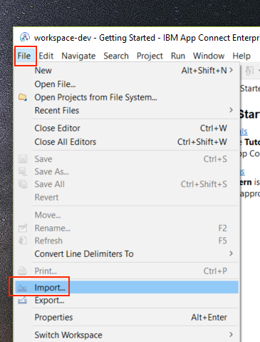

5. W oknie "Import", wybierz **Project Interchange** i kliknij *Next*.


6. W polu "*From zip file*" kliknij **Browse...** i wybierz **EDIFACT-Transport-D96A-Example.zip** z folderu `labfiles`, a następnie kliknij **Open**.

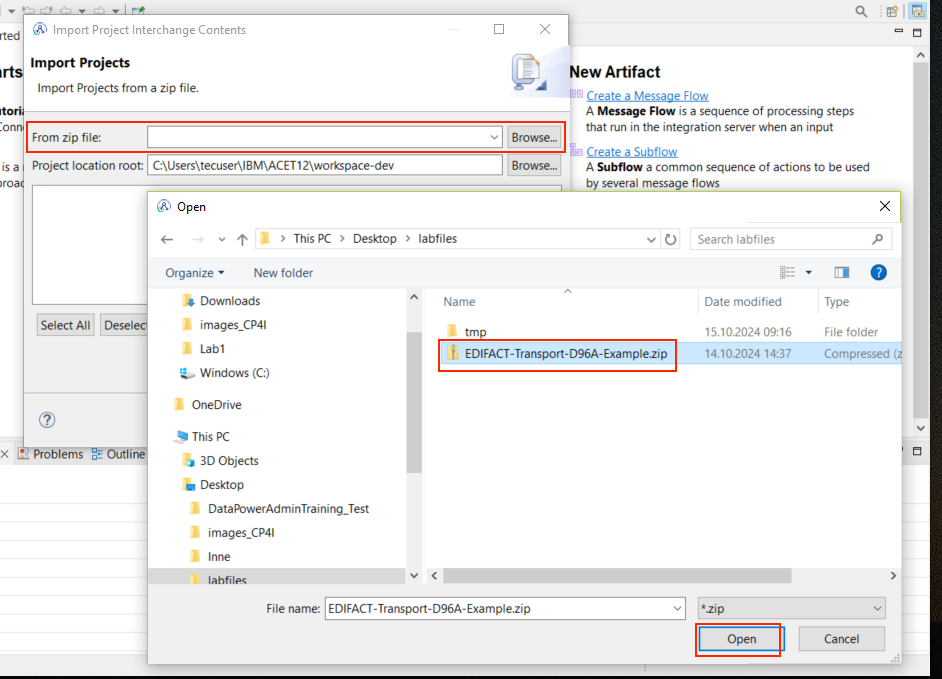

7. Wybierz dwie dostępne biblioteki i kliknij **Finish**.

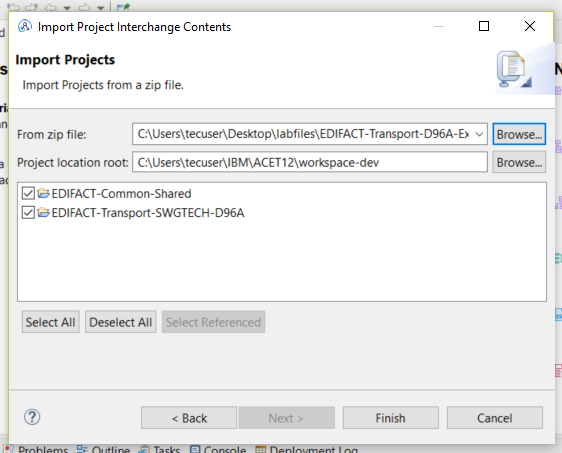

Zaimporotwałeś potrzebne biblioteki ze schematem transakcji EDIFACT analizowanej podczas tego scenariusza. W następnej cześci przetestujesz modelowanie danych EDIFACT z użyciem DFDL.

## Modelowanie danych EDIFACT z użyciem DFDL

Ta cześć ćwiczenia pokazuje, jak modelować dane UN/EDIFACT za pomocą schematu DFDL.

UN/EDIFACT to międzynarodowy standard wymiany informacji EDI w sektorach komercyjnych i niekomercyjnych. Strumienie danych UN/EDIFACT mają strukturę hierarchiczną, w której najwyższy poziom jest określany jako "interchange", a niższe poziomy zawierają wiele komunikatów, które składają się z segmentów, które z kolei składają się z kompozytów. Kompozyty z kolei składają się z elementów. Segmenty, kompozyty i elementy są oddzielone separatorami.

Edytor schematów DFDL, z którego skorzystamy, służy do przeglądania modelu i analizowania przykładowych plików danych EDIFACT.

Biblioteka **EDIFACT-Transport-SWGTECH-D96A** zawiera parę schematów DFDL, które modelują komunikaty UN/EDIFACT dla wersji D.96A. Dostępne są definicje typów komunikatów `IFTMIN`. Biblioteka zawiera pliki danych testowych. Biblioteka EDIFACT-Common zawiera schemat DFDL do definiowania wartości domyślnych dla właściwości DFDL oraz schemat DFDL do modelowania segmentów usług Uxx i komunikatów usług.

1. Biblioteki są wyświetlane w widoku **Application Development** obszaru roboczego. Kliknij dwukrotnie Schemat DFDL `EDIFACT-Transport-SWGTECH-Messages-D96A.xsd` w bibliotece **EDIFACT-Transport-SWGTECH-D96A**. Komunikat *Interchange* jest podświetlony i modeluje całą wymianę EDIFACT. Główny widok edytora pokazuje logiczne komponenty komunikatu, takie jak elementy i sekwencje. Strukturę komunikatu *Interchange* można eksplorować poprzez rozwijanie elementów.

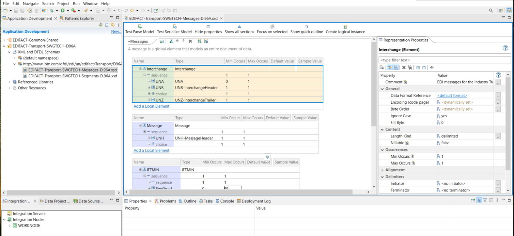

Renderowanie każdego komponentu logicznego jest opisane przez właściwości DFDL w zakładce **Representation Properties**. Właściwości DFDL mogą być określone lokalnie na komponencie lub mogą być dziedziczone z predefiniowanych zestawów właściwości DFDL. Odziedziczone właściwości mają ikonę "drzewka" pokazaną obok nich. Najechanie kursorem na ikonę ujawnia, gdzie zdefiniowana jest właściwość. W tym schemacie odziedziczone właściwości są uzyskiwane ze schematu **IBM_EDI_Format.xsd** w bibliotece *EDIFACT-Common*.

2. Ponieważ ustawienia ograniczników w wymianie EDIFACT mogą się różnić, właściwości *DFDL Terminator*, *Separator*, *Escape Character* i *Decimal Separator* są ustawiane dynamicznie przy użyciu wyrażeń DFDL, które odnoszą się do zmiennych DFDL. Zmienne mają wartości domyślne i są zastępowane przez ustawienia w segmencie *UNA*, jeśli są obecne. Można to zobaczyć, rozwijając element *UNA* w *Interchange*, wybierając dowolny element podrzędny i klikając kartę **Variables** obok opcji **Representation Properties**.

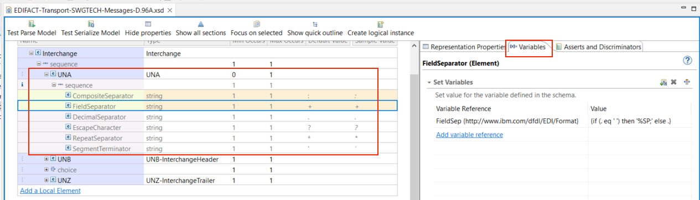

3. Będziesz testować parsowanie przykładowych danych EDIFACT za pomocą komunikatu *Interchange*. Parsowanie testowe odbywa się w edytorze DFDL. Przed parsowaniem testowym należy przełączyć się na perspektywę *DFDL Test*, klikając **Window > Perspective > Open Perspective > Other**, a następnie klikając **DFDL Test** i **Open**.

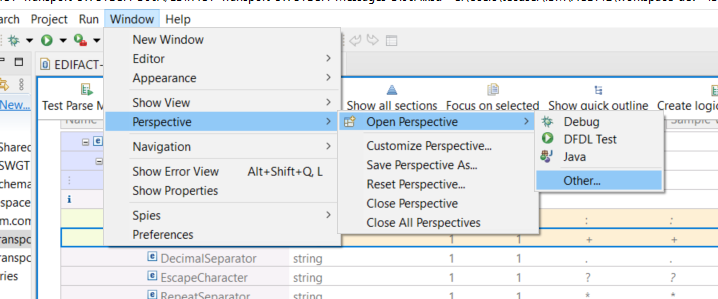

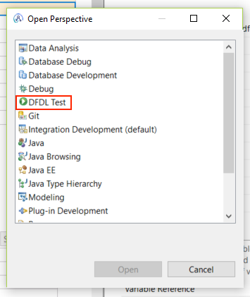

4. Przetestuj parsowanie przykładowego pliku danych:

- Kliknij **Test Parse Model** na pasku narzędzi edytora DFDL. Otworzy się okno **Test Parse Model**.

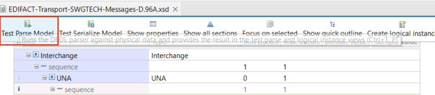

- W sekcji **Message** wybierz opcję **Interchange**.
- W sekcji **Parser Input** wybierz opcję *Content from a data file*, a następnie kliknij **Browse...**.
- Wybierz `plik edifact.edi` z **EDIFACT-Transport-SWGTECH-D96A**, a następnie kliknij **OK**.

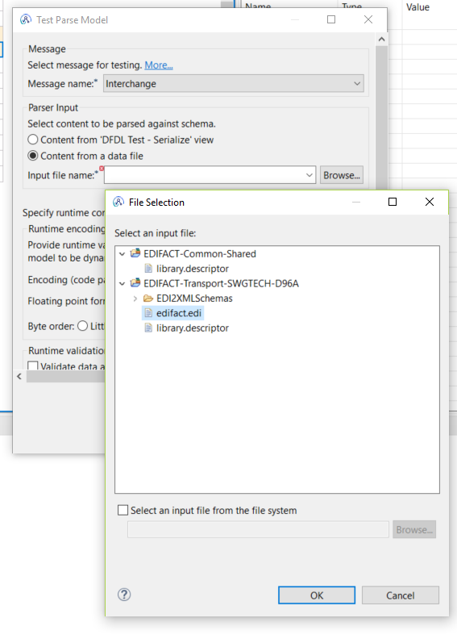

- Ustaw kodowanie na **ASCII**. Kliknij **OK**.

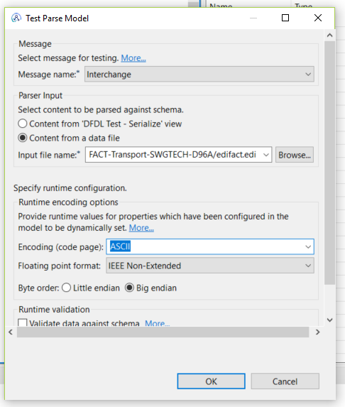

5. Wyświetlone zostaną wyniki parsowania testowego. Powinien zostać wyświetlony komunikat *"Parsowanie zakończone pomyślnie"*. Możesz zamknąć ten komunikat.
6. Przeanalizowany plik danych można wyświetlić w widoku **DFDL Test - Parse**. Wyniki parsowania można wyświetlić w widoku **DFDL Test - Logical Instance** jako drzewo lub XML. Dziennik działań parsera można wyświetlić w widoku **DFDL Test - Trace**.

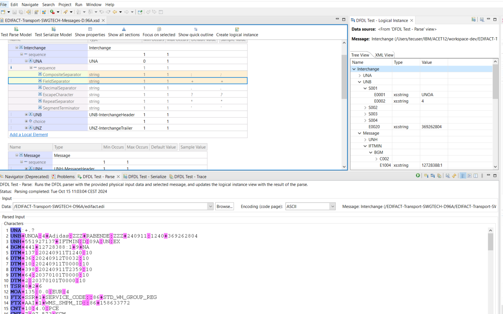

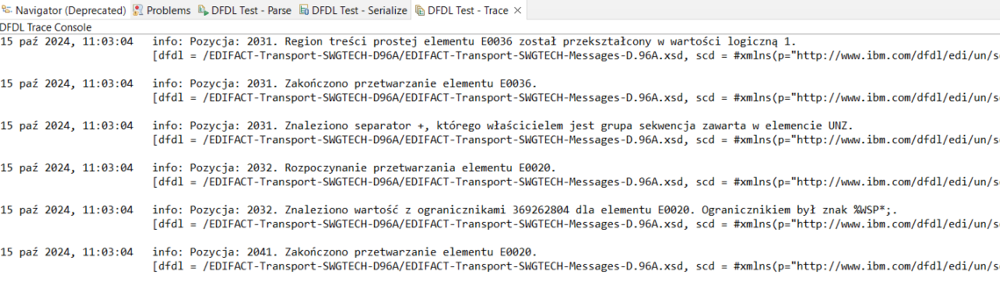

7. Przetestuj serializację instancji logicznej, która powstała w wyniku parsowania:

- Kliknij **Test Serialize Model** na pasku narzędzi edytora DFDL. Otworzy się okno **Test Serialize Model**.

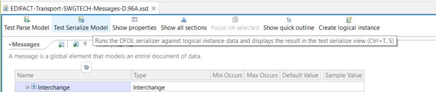

- W sekcji **Serializer Input** wybierz **Content from a DFDL Test - Logical Instance**.
- Ustaw kodowanie na **ASCII**. Kliknij **OK**.

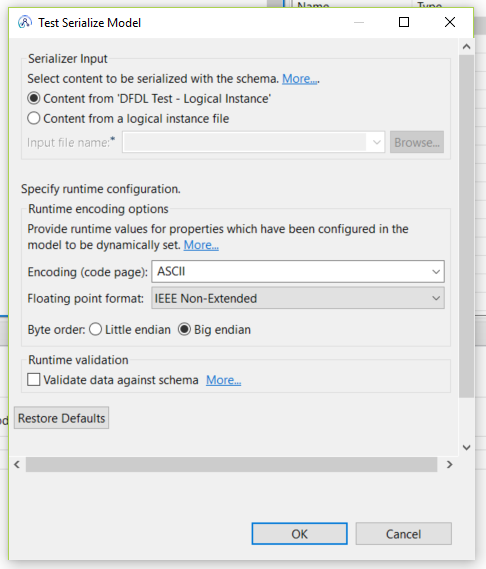

8. Wyświetlone zostaną wyniki testu serializacji. Powinien zostać wyświetlony komunikat *"Serializacja zakończone pomyślnie"*. Możesz zamknąć ten komunikat.
9. Zserializowany plik danych można wyświetlić w widoku **DFDL Test - Serialize**. Dziennik działań serializatora można wyświetlić w widoku **DFDL Test - Trace**.

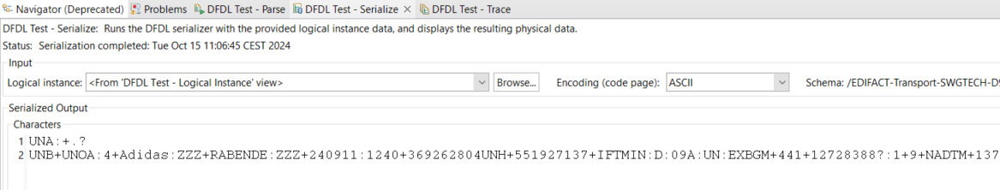

Dostarczone schematy DFDL pozwalaną na analizę komunikatów w potrzebnym formacie EDIFACT.

Jeśli wymagana jest obsługa składni UN/EDIFACT w wersji 3 zamiast składni w wersji 4, można edytować plik `IBM_EDI_Format.xsd` w bibliotece EDIFACT-Common. W tym pliku należy ustawić zmienną RepeatSep DFDL tak, aby przyjmowała wartość domyślną „**+**” (plus) zamiast „*” (gwiazdka).

Jeśli chcesz obsługiwać „**,**” (przecinek) jako domyślny separator dziesiętny zamiast „**.**” (kropka), możesz edytować plik `IBM_EDI_Format.xsd` w bibliotece EDIFACT-Common. W tym pliku należy zmienić zmienną DecimalSep DFDL, aby przyjąć domyślną wartość „**,**” (przecinek) zamiast „**.**” (kropka).

Obie biblioteki współdzielone można wdrożyć do węzła integracyjnego w celu wykorzystania przez przepływy komunikatów.

## Tworzenie aplikacji integracyjnej EDI2XML_App

W tej cześci ćwiczenia stworzysz apliakcję **EDI2XML_App**, która monitoruje folder `tmp`, pobiera plik `.edi`, mapuje wiadomość na format XML, a następnie wstawia do kolejki MQ.

1. Tworzenie przepływu aplikacji:

- Wróć do widoku **Integration Development**, klikając ikonę w prawym górnym rogu.


- Kliknij **New..**, a następnie **Application**.

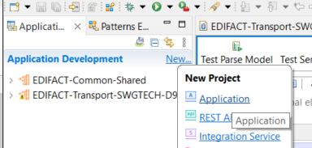

- Nazwij aplikacje `EDI2XML_App` i kliknij **Next**.

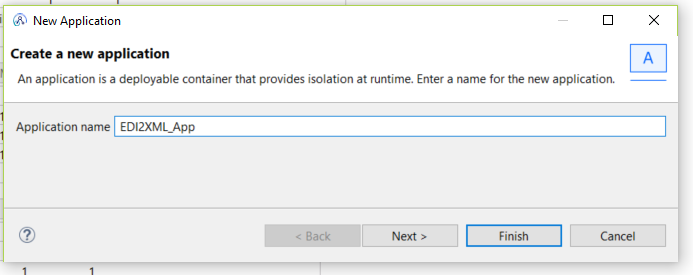

- Dodaj do projektu biblioteki ze schematem DFDL wiadomości EDIFACT i kliknij **Finish**.

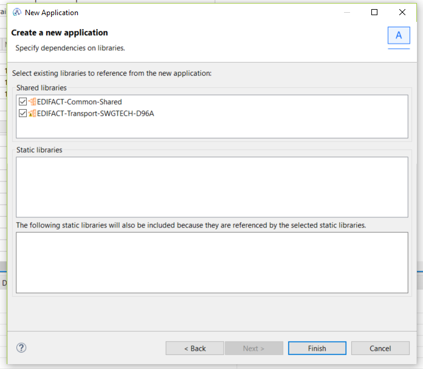

- W powstałej aplikacji kliknij **(New..)**, a następnie **Message Flow**.

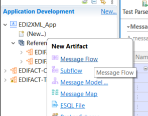

- Nazwij przeływ: `EDI2XML_MsgFlow`.

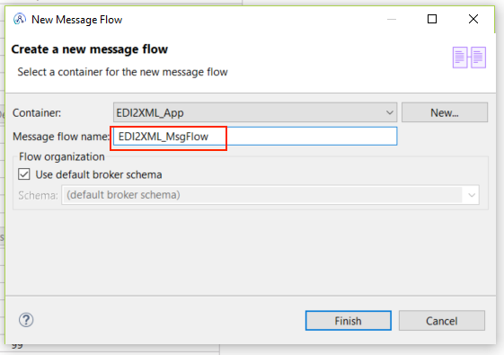

2. Konfiguracja węzła **FileInput**:

- W zakładce Palette w komórce `<Search>` wpisz `file`. Pojawią się węzły związane z przetwarzaniem plików.
- Kliknij **FileInput**, a następnie najedź kursorem na wolną przestrzeń po prawej stronie i kliknij ponownie lewym przyciskiem myszy. W ten sposób dodałeś węzeł **FileInput** do projektu przepływu.

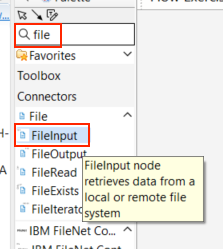

- Kliknij na węzeł i przejdź do zakładki *Basic*.
- W wierszu *Input directory* kliknij **Browse...** i wybierz folder `<path-to-labfile>/labfiles/tmp`. Kliknij **Select Folder**.

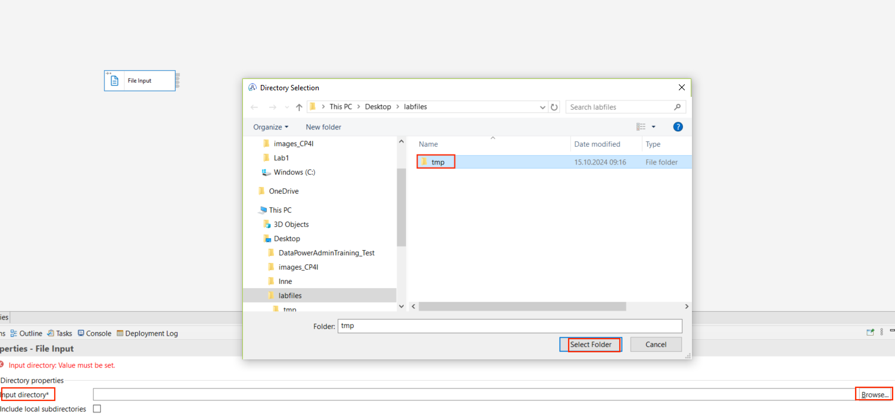

- W tej samej zakładce zdefiniuj *File name or pattern* jako `*.edi` i przejdź do zakładki *Input Message Parsing*.

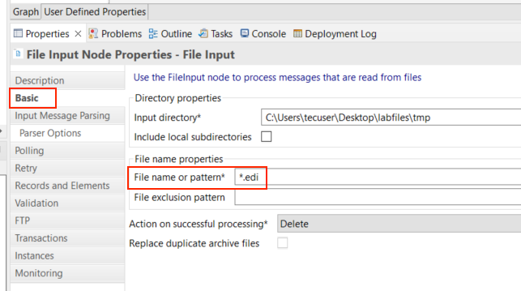

- W zakładce *Input Message Parsing* w *Message domain* wybierz **DFDL**.
- W *Message model* wybierz **EDIFACT-Transport-SWGTECH-D96A**.
- W *Message* wybierz **Interchange**.


- Przejdź do zakładki *Records and Elements* i ustaw *Record detection* na **Parsed Record Sequence**.

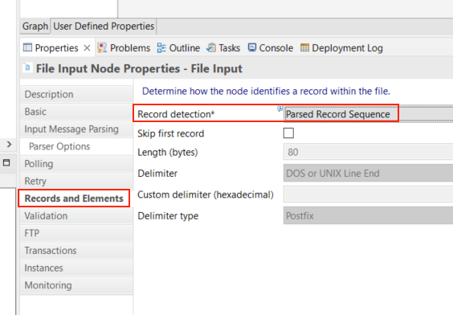

3. Konfiguracja węzła **Mapping**:

- W zakładce Palette w komórce `<Search>` wpisz `mapp`. Pojawią się węzły **Mapping**.
- Kliknij **Mapping**, a następnie najedź kursorem na wolną przestrzeń po prawej stronie od węzła **FileInput** i kliknij ponownie lewym przyciskiem myszy.

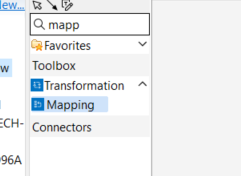

- Połącz terminal **Out** węzła **File Input** z terminalem **In** węzła **Mapping**.
- Kliknij dwukrotnie na węzeł **Mapping**, aby skonfigurować mapowanie wiadomości.
- Pozostaw ustawienia domyślne i kliknij **Next**.


- Wybierz modele danych wiadomości wejściowej: **Interchange** (EDIFACT) oraz wiadomości wyjściowej: **TransactionInstruction** (XML).

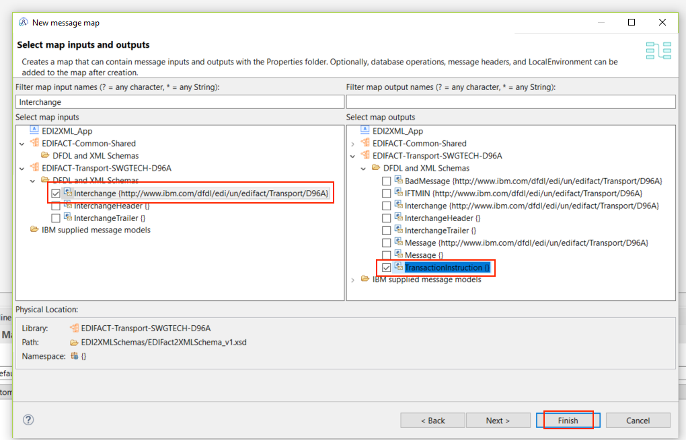

Schemat XML (`EDIFact2XMLSchema_v1.xsd`) jest modelem danych przykładowego, uproszczonego komunikatu XML **TransactionInstruction**. Został on stowrzony na potrzeby tego ćwiczenia. Wygląda on następująco:

```xml
<?xml version="1.0" encoding="UTF-8" standalone="no"?>
<xsd:schema xmlns:xsd="http://www.w3.org/2001/XMLSchema">
<xsd:element name="InterchangeHeader" type="Header"></xsd:element>
    <xsd:complexType name="Header">
    	<xsd:sequence>
    		<xsd:element name="InterchangeSender" type="xsd:string"></xsd:element>
    		<xsd:element name="InterchangeRecipient" type="xsd:string"></xsd:element>
    		<xsd:element name="DateOfPreparation" type="xsd:string"></xsd:element>
    	</xsd:sequence>
    </xsd:complexType>
<xsd:element name="Message" type="Message"></xsd:element>
    <xsd:complexType name="Message">
    	<xsd:sequence>
    		<xsd:element name="MessageType" type="xsd:string"></xsd:element>
    		<xsd:element name="DocumentMessageNameCoded"
    			type="xsd:string">
    		</xsd:element>
    		<xsd:element name="DateTimePeriod " type="xsd:string"
    			maxOccurs="unbounded" minOccurs="0">
    		</xsd:element>
    		<xsd:element name="ServiceRequirementCoded"
    			type="xsd:string" maxOccurs="unbounded" minOccurs="0">
    		</xsd:element>
    		<xsd:element name="ControlTotal" type="Control" maxOccurs="unbounded" minOccurs="0"></xsd:element>
    	</xsd:sequence>
    </xsd:complexType>

    <xsd:complexType name="Control">
    	<xsd:sequence>
    		<xsd:element name="ControlQualifier" type="xsd:string"></xsd:element>
    		<xsd:element name="ControlValue" type="xsd:double"></xsd:element>
    		<xsd:element name="MeasureUnitQualifier" type="xsd:string"></xsd:element>
    	</xsd:sequence>
    </xsd:complexType>

    <xsd:element name="InterchangeTrailer" type="Trailer"></xsd:element>
    
    <xsd:complexType name="Trailer">
    	<xsd:sequence>
    		<xsd:element name="InterchangeControlReference" type="xsd:string"></xsd:element>
    	</xsd:sequence>
    </xsd:complexType>

    <xsd:element name="TransactionInstruction" type="Transaction"></xsd:element>
    
    <xsd:complexType name="Transaction">
    	<xsd:sequence>
    		<xsd:element name="InterchangeHeader" type="Header"></xsd:element>
    		<xsd:element name="Message" type="Message"></xsd:element>
    		<xsd:element name="InterchangeTrailer" type="Trailer"></xsd:element>
    	</xsd:sequence>
    </xsd:complexType>
</xsd:schema>
```

Wykorzystamy ten model danych jako docelowy format wiadomości wyjściowej.

- Połącz odpowiednie pola z modelu **Interchange** (EDIFACT) z polami z modelu **TransactionInstruction** (XML) zgodnie z tabelą poniżej:

| **Interchange** (EDIFACT)  | **TransactionInstruction** (XML) |
| ------------- | ------------- |
| Interchange-UNB-S002-E0004-InterchangeSender  | InterchangeHeader-InterchangeRecipient |
| Interchange-UNB-S003-E0010-InterchangeRecipient | InterchangeHeader-InterchangeSender |
| Interchange-UNB-S004-E0017-Date | InterchangeHeader-DateAndTimeOfPreparation |
| Message-UNH-S009-E0065-MessageType | Message-MessageType |
| Message-IFTMIN-BGM-C002-E1001-DocumentMessageNameCoded | Message-DocumentMessageNameCoded |
| Message-IFTMIN-DTM-C507-E2380-DateTimePeriod | Message-DateTimePeriod |
| Message-IFTMIN-TSR-C233-E7273a-ServiceRequirementCoded | Message-ServiceRequirementCoded |
| Message-IFTMIN-CNT-ControlTotal | Message-ControlTotal |
| (w ControlTotal) C270-E6069-ControlQualifier | ControlQualifier |
| (w ControlTotal) C270-E6066-ControlValue | ControlValue |
| (w ControlTotal) C270-E6411-MeasureUnitQualifier | MeasureUnitQualifier |
| UNZ-E0020-InterchangeControlReference | InterchangeTrailer-InterchangeControlReference |

<details>
<summary><b><font color="dodgerblue">Kliknij, aby otowrzyć:</font></b> Instrukcja połączenia poszczególnych komponentów "Mapy"</summary>

1. Połączenia w sekcji **InterchangeHeader**.

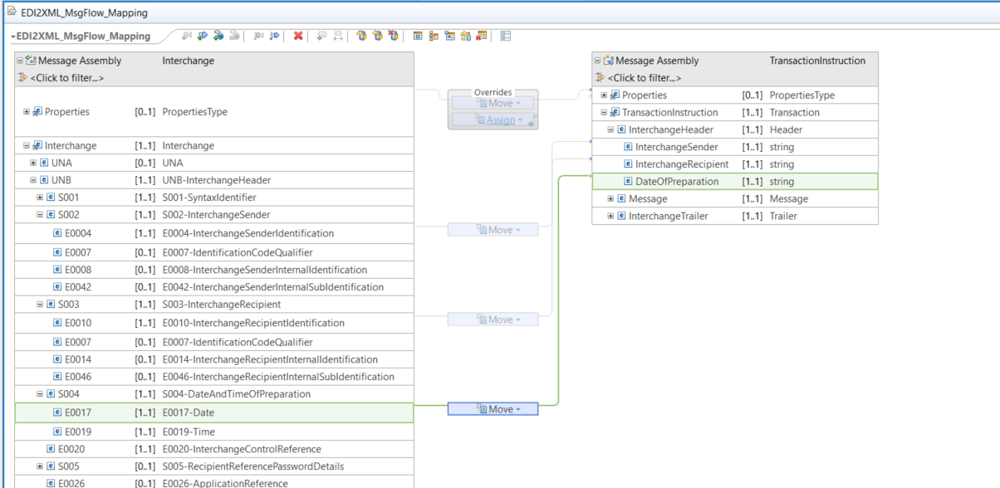

2. Połączenia w sekcji **Message**. 

- Kliknij na `quick fix` (ikona "żarówki"): "Set cardinality to first index".

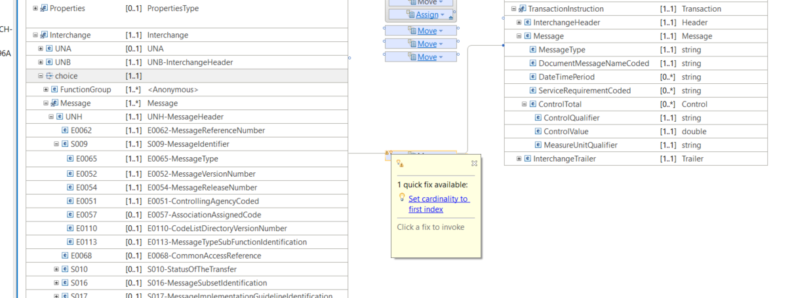

- Dla połączeń typu `For each` wejdź do mapy "zagnieżdżonej".

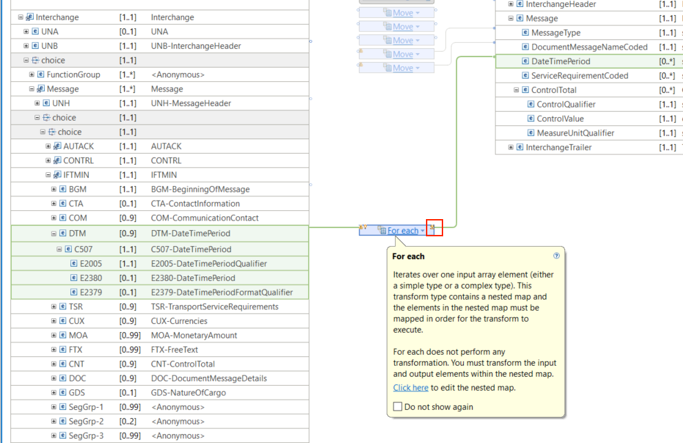

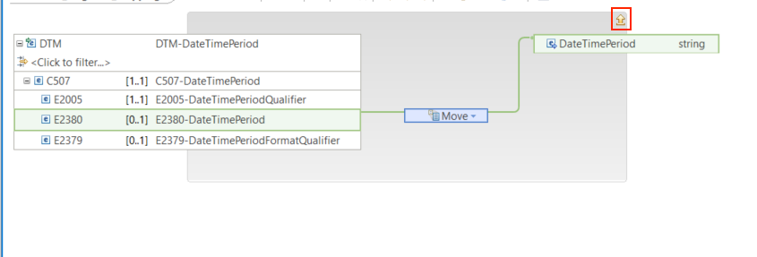

- Wróć do mapy "głównej"
- Powtórz czynność dla innych pól.

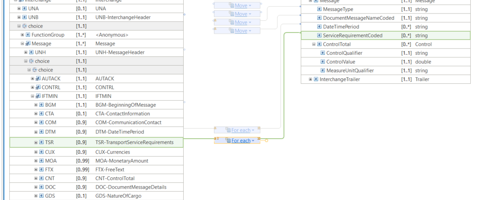

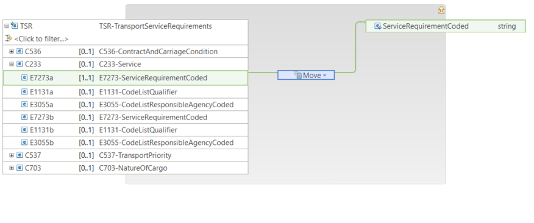

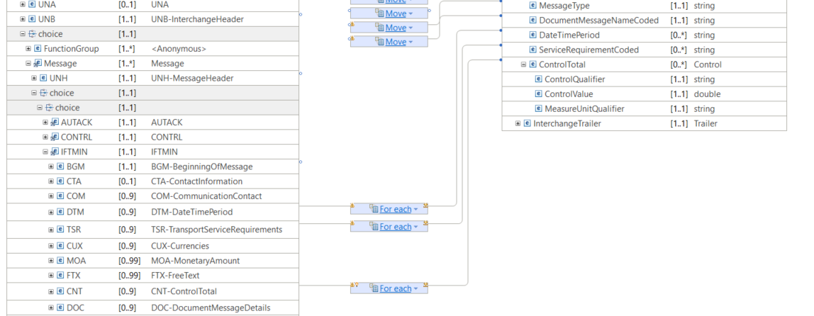

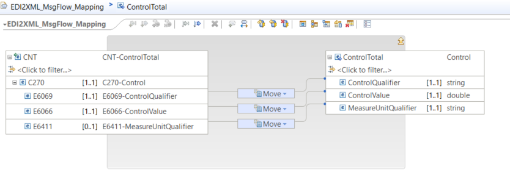

3. Połączenia w sekcji **InterchangeTrailer**.

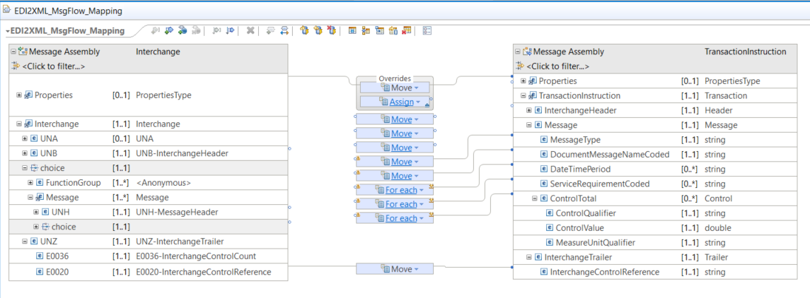


</details>

- Zapisz **Mapę**, klikając **Ctrl + S**
- Wróć do zakładki przepływu i zapisz przepływ, klikając **Ctrl + S**.

## Konfiguracja MQ

W tym etapie skonfigurujemy menadżera kolejek MQ (QM1) oraz lokalną kolejkę Q1, a także port do nasłuchiwania. Następnie w **ACET** skonfigurujemy politykę, która pozwoli nam się połączyć z lokalnym MQ. 

> [!WARNING]
> Na tym etapie zakładamy, że IBM MQ Server oraz IBM MQ Explorer został zainstalowany.

1. Otwórz `Terminal (CMD)` jako administrator, a następnie wykonaj komendę `dspmqver`. Wyświetlą się informacje dotyczące instalacji MQ.

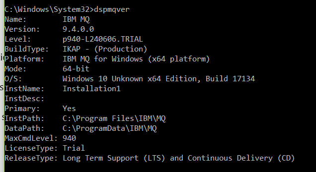

2. Stwórz menadżera kolejek MQ (QM1), wykonując komendę `crtmqm QM1`.

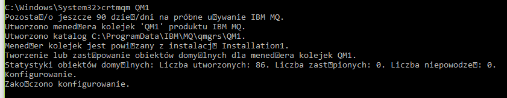

3. Po pomyślnym stowrzeniu QM1, uruchom go wykonując komendę `strmqm QM1`.

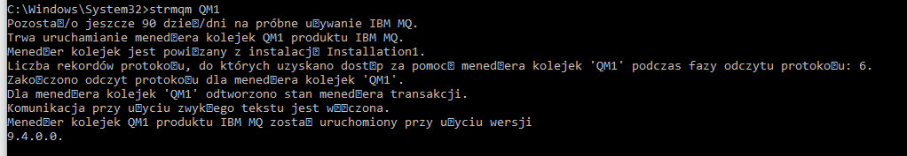

4. Wykonaj komendę `runmqsc QM1`, aby wejść do QM1.

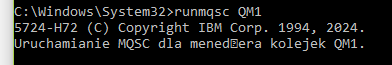

5. Stwórz kolejkę Q1, wykonując komendę `def QL(Q1)`.

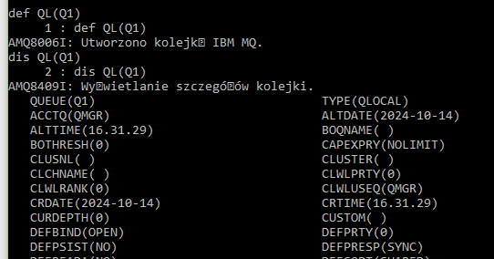

6. Wyświetl szczegóły kolejki komendą `dis QL(Q1)`.
7. Zakończ tryb MQSC, wykonując komendę `end`.
8. Wyszukaj i otwórz **MQ Explorer**.

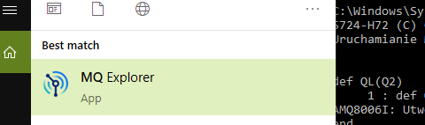

**IBM MQ Explorer** to graficzny interfejs użytkownika, za pomocą którego można administrować i monitorować obiekty IBM MQ, niezależnie od tego, czy są one hostowane na komputerze lokalnym, czy w systemie zdalnym. Można zdalnie łączyć się z menedżerami kolejek działającymi na dowolnej obsługiwanej platformie, umożliwiając przeglądanie, eksplorowanie i modyfikowanie całego szkieletu przesyłania wiadomości z poziomu UI. 

9. Kliknij ikonę "+/-" w prawym górnym rogu, która pozwoli Ci zobaczyć wszystkie systemowe elemtny menedżera kolejek **QM1**, a następnie przejdź do folderu "*Nasłuchiwanie*" (Listening).

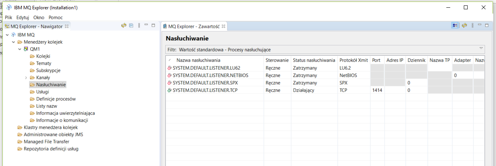

10. Ustaw port `1414` na nasłuchu TCP `SYSTEM.DEFAULT.LISTENER.TCP` i kliknij **OK**.

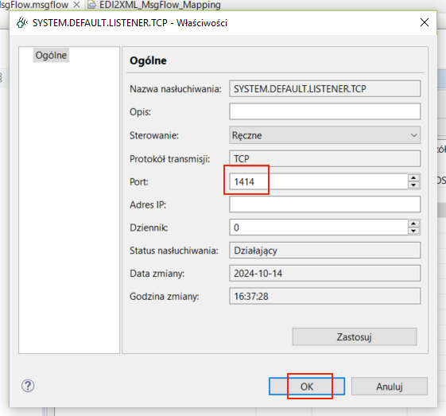

## Konfiguracja MQ Policy

W nastepnym kroku stworzymy projekt polityki MQ, aby kontrolować wartości konfiguracje połączenia węzła MQ.

1. Wróć do narzędzia ACET i kliknij **New...**, a następnie dodaj **Policy Project**.

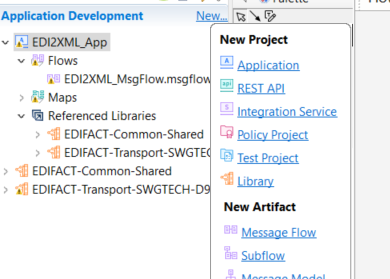

- Nazwij projekt `MQPolicyProject`, a następnie kliknij **Finish**.

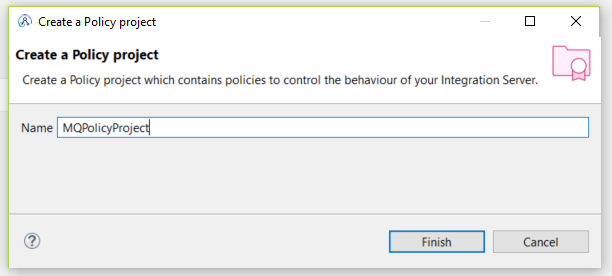

2. Stwórz politykę, klikająć **(New..)** i **Policy**.

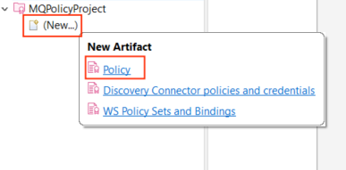

- Nazwij projekt `MQPolicy`, a następnie kliknij **Finish**.
- Wybierz **Type** polityki: `MQEndpoint`.
- Wybierz **Template** polityki: `MQEndpoint`.
- Pojawi się szablon, który wypełnij zgodnie z tabelą ponieżj:

| Property  | Value |
| ------------- | ------------- |
| Connection  | SERVER |
| Queue manager name | QM1 |
| Queue manager host name | localhost |
| Listener port number | 1414 |
| Channel name | SYSTEM.DEFAULT.LISTENER.TCP |

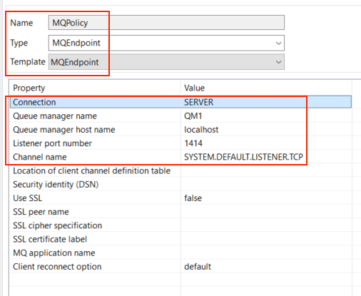

Reszte pozycji pozostaw bez zmian.

3. Zapisz politykę.

## Tworzenie aplikacji integracyjnej EDI2XML_App c.d.

1. Na tym etapie ćwiczenia skonfigurujemy ostatni węzeł przepływu: **MQ Output**.

- W zakładce Palette w komórce `<Search>` wpisz `mq`. Pojawią się węzły **MQ**.
- Kliknij **MQOutput**, a następnie najedź kursorem na wolną przestrzeń po prawej stronie od węzła **Mapping** i kliknij ponownie lewym przyciskiem myszy.
- Połącz terminal **Out** węzła **Mapping** z terminalem **In** węzła **MQ Output**.
- Kliknij na węzeł i przejdz do zakładki *Basic*.
- W polu *Queue name* wpisz `Q1`.

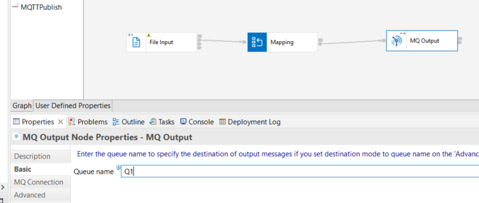

- Przejdź do zakładki *Policy* i kliknij **Browse...**.
- Wybierz dostępną politykę **MQPolicy** i kliknij **OK**

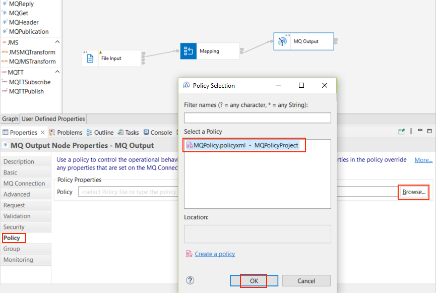

2. Zapisz gotową aplikacje **EDI2XML_App**.

## Testowanie aplikacji integracyjnej EDI2XML_App

Zanim przejdzeimy do testowania musimy wdrożyć na serwer wykorzystywane w przepływie biblioteki oraz politykę MQ.

1. Aby wdrożyć biblioteki EDIFACT, nalży kliknąć prawym przycieskiem myszy na bibliotekę: **EDIFACT-Transport-SWGTECH-D96A**, a następnie kliknij **Deploy** i wybierz serwer integracyjny **IntServer**. 

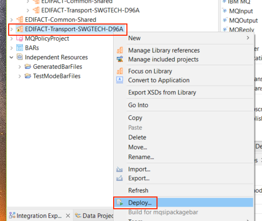

2. Aby wdrożyć projekt polityki MQ, należy kliknąć prawym przycieskiem myszy na projekt, a następnie kliknij **Deploy** i wybierz serwer integracyjny **IntServer**.

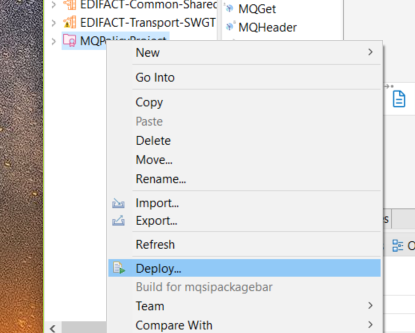

Teraz mamy na serwerze szystkie potrzebne komponenty, aby wdrożyć aplikacje **EDI2XML_App**.

3. Do testowania aplikacji wykorzystasz narzędzie **Flow Exerciser**, które wdroży aplikacje na serwer oraz prześledzi komunikaty na każdym etapie przepływu:

- Kliknij ikonę "nagrywania" przy **Flow Exerciser**.

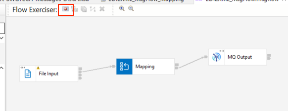

- Po uruchomieniu **Flow Exerciser**, pojawi się informacja o śledzeniu przepływu oraz aplikacja zostanie uruchomiona na serwerze.

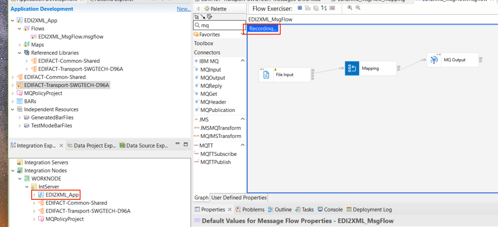

4. Przejdź do folderu `labfiles` i skopiuj plik `editest.edi`.

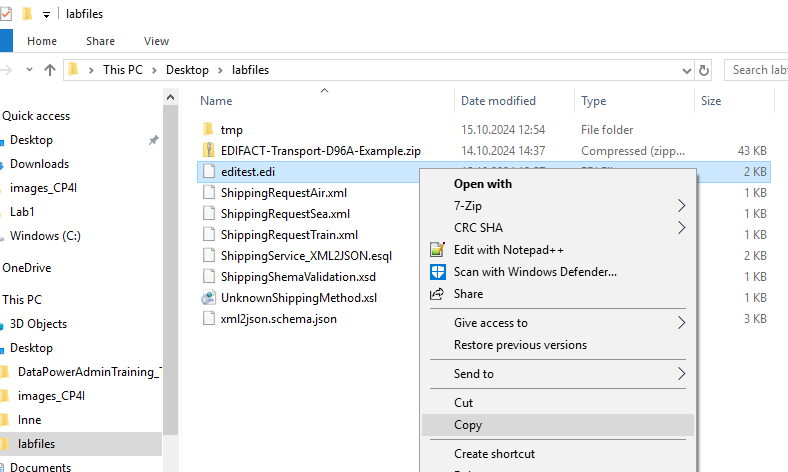

5. Przejdź do folderu `tmp`, a następnie wklej plik `editest.edi`. Po chwili wklejony plik powinien zniknąć, co oznacza, że został on przetowrzony.
6. Wróc do ACET i kliknij ikonę "ścieżki" wiadomości.

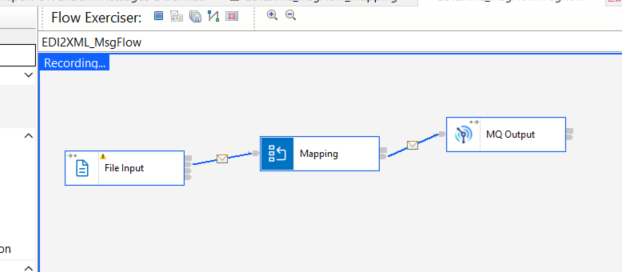

7. Kliknij na pierwszą "kopertę" pokazującą komunikat odebrany i sparsowany przez węzeł **File Input**. Rozwiń zakładkę *message* oraz *DFDL*, aby przeanalizować wiadomość.

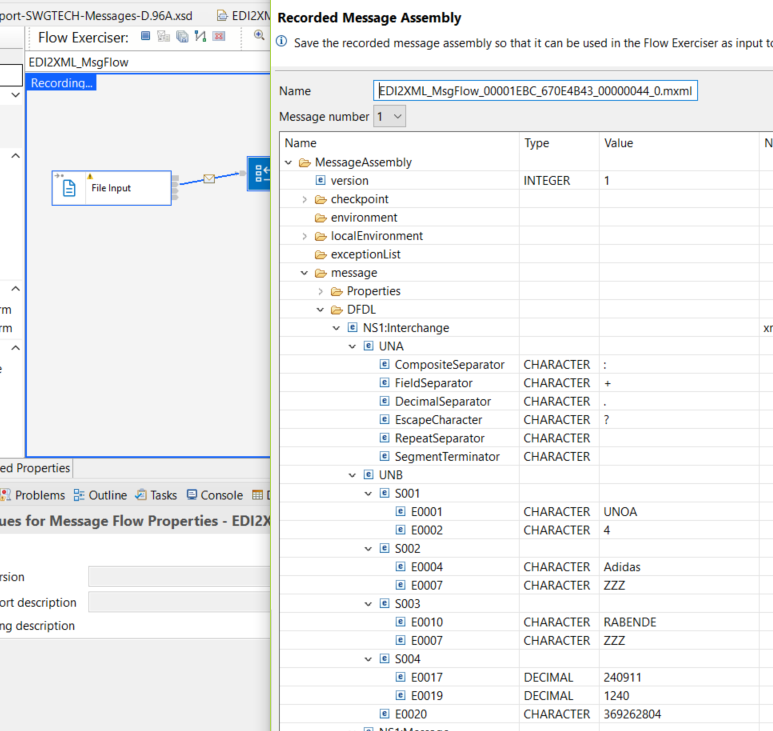

8. Kliknij na druga "kopertę" pokazującą komunikat zmapowany na format XML przez węzeł **Mapping**. Rozwiń zakładkę *message* oraz *XMLNSC*, aby przeanalizować wiadomość.

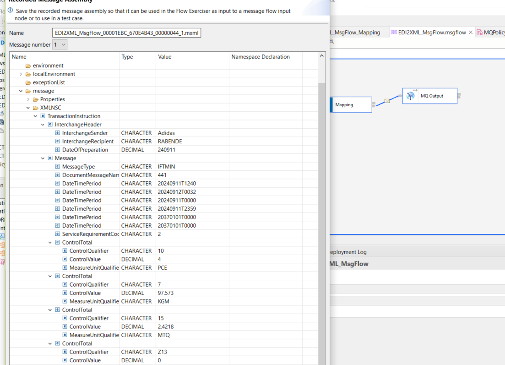

Wiadomość zozostała przetworzona zgodnie z naszymi oczekiwaniami.

9. Zatrzymaj narzędzie **Flow Exerciser**, klikając ikonę "Stop".

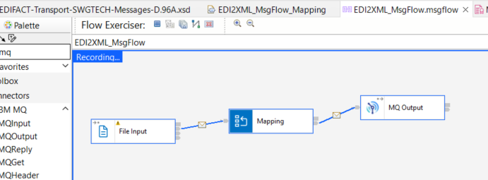

10. Aby sprawdzić, czy nasza wiadomość trafiła do kolejki, wróć do narzędzia **IBM MQ Explorer**.

- Kliknij prawym przyciskiem myszy na kolejkę **Q1**, a następnie *Przeglądaj komunikaty...*

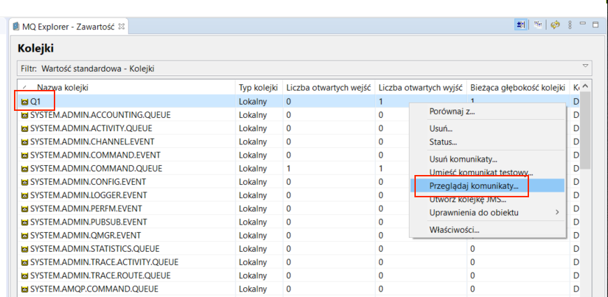

- Widzimy, że wysłany komunikat czeka na odebranie w kolejce **Q1**.

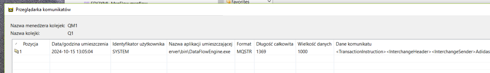

***KONIEC ĆWICZENIA - Gratulacje!***

## Podsumowanie

Podczas wykonywania ćwiczenia stworzyłeś przepływ integracyjny zawierający różne węzły integracyjne. Wykorzystałeś węzeł *File Input*, aby monitorować folder wyjeściowy wiadomości EDIFACT. Wykorzystałeś węzeł *Mapping*, aby zmapować format EDIFACT na format XML. Skonfigutrowałeś lokalny system kolejkowy MQ oraz połączenie MQ z ACE poprzez politykę. Użyłeś węzłów *MQ Output*, aby wrzucić komunikat to kolejki. Przetestowałeś przepływ komunikatu z wykorzystaniem narzędzia *Flow Exerciser*. Dodatkowo zrozumiałeś składnie języka DFDL oraz użyłeś widoku *DFDL Test* do testowania, modelowania, analizowania i parsowania danych EDIFACT zgodnie ze schematem DFDL.
