# Transformacja danych w formacie EDIFACT do formatu XML – EDI2XML_App

## Czas ćwiczenia

00:30

## Opis ćwiczenia

W tym ćwiczeniu stworzysz aplikacje integracyjną „EDI2XML_App”, która będzie monitorowała, czy we wskazanym przez Ciebie folderze pojawił sie plik w formacie `.edi`. Plik zostanie pobrany oraz sparsowany i przekazany do węzła mapującego wartości z dokumentu EDIFACT do odpowiednich pól w formacie XML. Sformatowaną wiadomość zostanie przesłane do kolejki MQ. 

## Cele

Po ukończeniu tego ćwiczenia powinieneś potrafić:
- Użyć węzła *FileInput* do przetwarzania komunikatów odczytywanych z plików.
- Użyć widoku *DFDL Test* do testowania, modelowania, analizowania i parsowania danych EDIFACT zgodnie ze schematem DFDL.
- Importować i korzystać z udostępnionych bibliotek.
- Użyć węzła Mapping do mapowania wiadomości w formacie EDIFACT do formatu XML.
- Stowrzyć politykę pozwalającą połączyć się z MQ.
- Skonfigurować menagera kolejek, kolejkę oraz węzeł MQInput.

## Wstęp

Firma logistyczna otrzymuje komunikaty w formacie `.edi` do zdefiniowanej lokalizacji. Potrzebujemy stowrzć aplikacje, która przetworzy i zrozumie poszczególne transakcje zawarte w pliku na następnie zmapuje je na odpowiedni format XML. Aplikacja powinna wrzucać zmapowane wiadomości do kolejki MQ, aby następna aplikacja mogła pobrać wiadomość nie zależnie od systemu wyłającego komunikat.

## Wymagania

- Środowisko warsztatowe z zainstalowanym [IBM App Connect Enterprise Toolkit (ACET)](https://www.ibm.com/docs/en/app-connect/12.0?topic=enterprise-download-ace-developer-edition-get-started).
- Środowisko warsztatowe z zainstalowanym [IBM MQ Server](hhttps://www.ibm.com/docs/en/ibm-mq/9.3?topic=windows-installing-server-using-launchpad) oraz [IBM MQ Explorer](https://www.ibm.com/docs/en/ibm-mq/9.3?topic=windows-installing-stand-alone-mq-explorer).
- Pobrany i rozpakowany folder z plikami potrzebnymi do ćwiczeń laboratoryjnych [labfiles](https://github.com/jawor96/Warsztaty_CP4I/tree/main/labfiles).
- Dostęp do narzędzia do testowania komunikacji (Postman lub SoapUI).

## Przygotowanie środowiska

Uruchom aplikacje IBM App Connect.

1.	Kliknij w Search w pasku narzędzi i wyszukaj aplikacji IBM App Connect Enterprise Toolkit 13/12.
2.	Kliknij w aplikacje, aby ją uruchomić.


3.	Zostaw domyślny **Workspace**: `<path-to-ACE>\IBM\ACET13(12)\workspace` i kliknij **Launch**. Aplikacja ACET uruchomi się po chwili.


4. Kliknij **File** i **Import..**, aby zaimportować biblioteki zawierające schematy komunikatów *EDIFACT*.


5. W oknie "Import", wybierz **Project Interchange** i kliknij *Next*.

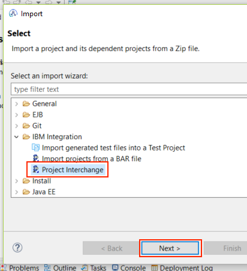

6. Kliknij **Browse...** w "*From zip file*" i wybierz **EDIFACT-Transport-D96A-Example.zip** z folderu `labfiles`, a następnie kliknij **Open**.


7. Wybierz dwie dostępne biblioteki i kliknij **Finish**.

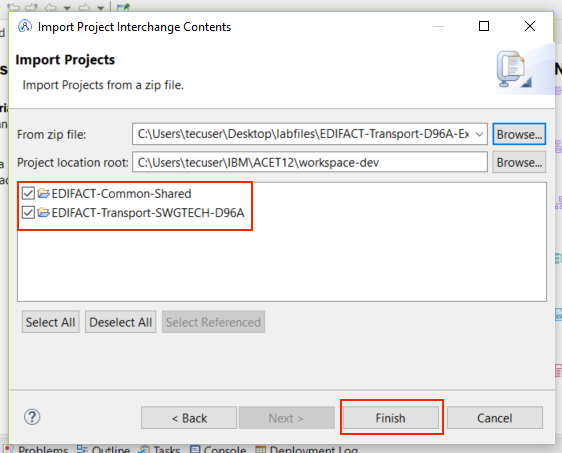

Zaimporotwałeś potrzebne biblioteki ze schematem transakcji EDIFACT analizowanej podczas tego scenariusza. W następnej cześci przetestujesz modelowanie danych EDIFACT z użyciem DFDL.

## Modelowanie danych EDIFACT z użyciem DFDL

Ta cześć ćwiczenia pokazuje, jak modelować dane UN/EDIFACT za pomocą schematu DFDL.

UN/EDIFACT to międzynarodowy standard wymiany informacji EDI w sektorach komercyjnych i niekomercyjnych. Strumienie danych UN/EDIFACT mają strukturę hierarchiczną, w której najwyższy poziom jest określany jako "interchange", a niższe poziomy zawierają wiele komunikatów, które składają się z segmentów, które z kolei składają się z kompozytów. Kompozyty z kolei składają się z elementów. Segmenty, kompozyty i elementy są oddzielone separatorami.

Edytor schematów DFDL, z którego skorzystamy, służy do przeglądania modelu i analizowania przykładowych plików danych EDIFACT.

Biblioteka **EDIFACT-Transport-SWGTECH-D96A** zawiera parę schematów DFDL, które modelują komunikaty UN/EDIFACT dla wersji D.96A. Dostępna jest definicje typów komunikatów `IFTMIN`. Biblioteka zawiera pliki danych testowych. Biblioteka EDIFACT-Common zawiera schemat DFDL do definiowania wartości domyślnych dla właściwości DFDL oraz schemat DFDL do modelowania segmentów usług Uxx i komunikatów usług.

1. Biblioteki są wyświetlane w widoku **Application Development** obszaru roboczego. Kliknij dwukrotnie Schemat DFDL `EDIFACT-Transport-SWGTECH-Messages-D96A.xsd` w bibliotece **EDIFACT-Transport-SWGTECH-D96A**. Komunikat *Interchange* jest podświetlony i modeluje całą wymianę EDIFACT. Główny widok edytora pokazuje logiczne komponenty komunikatu, takie jak elementy i sekwencje. Strukturę komunikatu *Interchange* można eksplorować poprzez rozwijanie elementów.

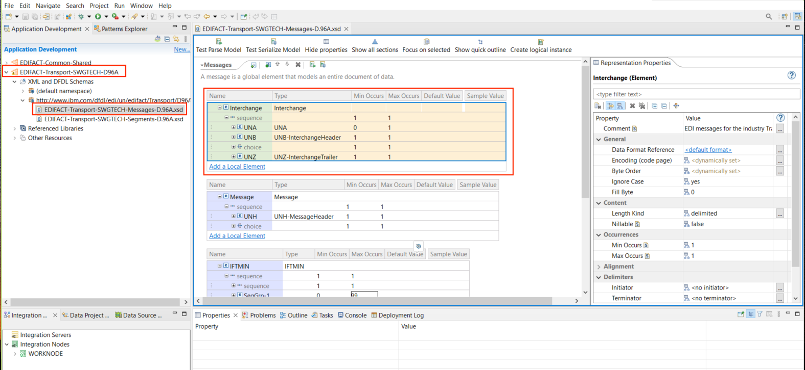

Renderowanie każdego komponentu logicznego jest opisane przez właściwości DFDL w zakładce "**Representation Properties**". Właściwości DFDL mogą być określone lokalnie na komponencie lub mogą być dziedziczone z predefiniowanych zestawów właściwości DFDL. Odziedziczone właściwości mają ikonę "drzewka" pokazaną obok nich. Najechanie kursorem na ikonę ujawnia, gdzie zdefiniowana jest właściwość. W tym schemacie odziedziczone właściwości są uzyskiwane ze schematu **IBM_EDI_Format.xsd** w bibliotece *EDIFACT-Common*.

2. Ponieważ ustawienia ograniczników w wymianie EDIFACT mogą się różnić, właściwości *DFDL Terminator*, *Separator*, *Escape Character* i *Decimal Separator* są ustawiane dynamicznie przy użyciu wyrażeń DFDL, które odnoszą się do zmiennych DFDL. Zmienne mają wartości domyślne i są zastępowane przez ustawienia w segmencie *UNA*, jeśli są obecne. Można to zobaczyć, rozwijając element *UNA* w *Interchange*, wybierając dowolny element podrzędny i klikając kartę **Variables** obok opcji **Representation Properties**.


3. Będziesz testować parsowanie przykładowych danych EDIFACT za pomocą komunikatu *Interchange*. Parsowanie testowe odbywa się w edytorze DFDL. Przed parsowaniem testowym należy przełączyć się na perspektywę DFDL Test, klikając **Window > Perspective > Open Perspective . Other**, a następnie klikając **DFDL Test** i **Open**.


4. Przetestuj parsowanie przykładowego pliku danych:

- Kliknij **Test Parse Model** na pasku narzędzi edytora DFDL. Otworzy się okno **Test Parse Model**.


- W sekcji Message wybierz opcję **Interchange**.
- W sekcji **Parser Input** wybierz opcję *Content from a data file*, a następnie kliknij przycisk **Browse**.
- Wybierz `plik edifact.edi` z **EDIFACT-Transport-SWGTECH-D96A**, a następnie kliknij **OK**.


- Ustaw kodowanie na **ASCII**. Kliknij **OK**.

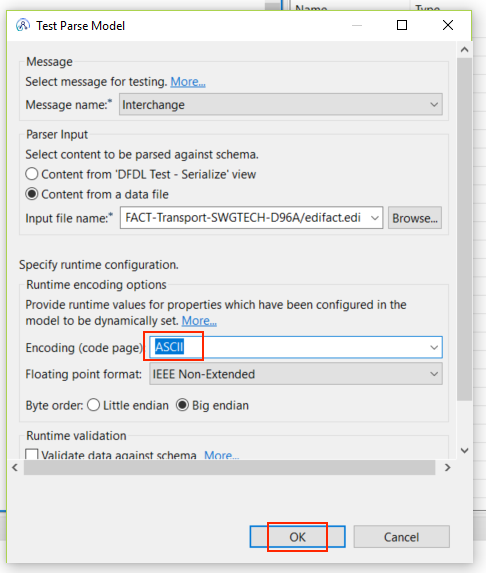

5. Wyświetlone zostaną wyniki parsowania testowego. Powinien zostać wyświetlony komunikat *"Parsowanie zakończone pomyślnie"*. Możesz zamknąć ten komunikat.
6. Przeanalizowany plik danych można wyświetlić w widoku **DFDL Test - Parse**. Wyniki parsowania można wyświetlić w widoku **DFDL Test - Logical Instance** jako drzewo lub XML. Dziennik działań parsera można wyświetlić w widoku **DFDL Test - Trace**.


7. Przetestuj serializację instancji logicznej, która powstała w wyniku parsowania:

- Kliknij **Test Serialize Model** na pasku narzędzi edytora DFDL. Otworzy się okno **Test Serialize Model**.


- W sekcji **Serializer Input** wybierz **Content from a DFDL Test - Logical Instance**.
- Ustaw kodowanie na **ASCII**. Kliknij **OK**.

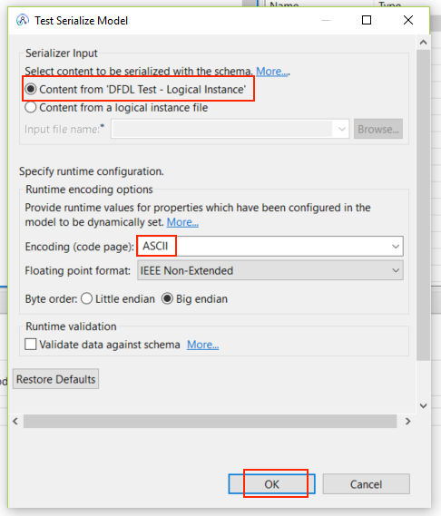

8. Wyświetlone zostaną wyniki testu serializacji. Powinien zostać wyświetlony komunikat *"Serializacja zakończone pomyślnie"*. Możesz zamknąć ten komunikat.
9. Zserializowany plik danych można wyświetlić w widoku **DFDL Test - Serialize**. Dziennik działań serializatora można wyświetlić w widoku **DFDL Test - Trace**.


Dostarczone schematy DFDL pozwalaną na analizę komunikatów w potrzebnym formacie EDIFACT.

Jeśli wymagana jest obsługa składni UN/EDIFACT w wersji 3 zamiast składni w wersji 4, można edytować plik `IBM_EDI_Format.xsd` w bibliotece EDIFACT-Common. W tym pliku należy ustawić zmienną RepeatSep DFDL tak, aby przyjmowała wartość domyślną „**+**” (plus) zamiast „*” (gwiazdka).

Jeśli chcesz obsługiwać „**,**” (przecinek) jako domyślny separator dziesiętny zamiast „**.**” (kropka), możesz edytować plik `IBM_EDI_Format.xsd` w bibliotece EDIFACT-Common. W tym pliku należy zmienić zmienną DecimalSep DFDL, aby przyjąć domyślną wartość „**,**” (przecinek) zamiast „**.**” (kropka).

Obie biblioteki współdzielone można wdrożyć do węzła integracyjnego w celu wykorzystania przez przepływy komunikatów.

## Tworzenie aplikacji integracyjnej EDI2XML_App

W tej cześci ćwiczenia stworzysz apliakcje **EDI2XML_App**, która monitoruje folder `tmp`, pobiera plik `.edi`, mapuje wiadomość na format XML, a następnie wstawia do kolejki MQ.

1. Tworzenie przepływu aplikacji:

- Wróć do widoku **integration Development**, klikając ikonę w prawym górnym rogu.

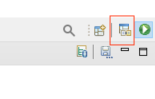

- Kliknij **New..**, a następnie **Application**.

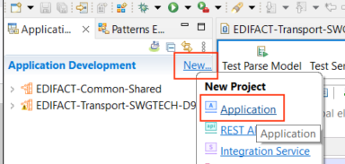

- Nazwij aplikacje `EDI2XML_App` i kliknij **Next**.

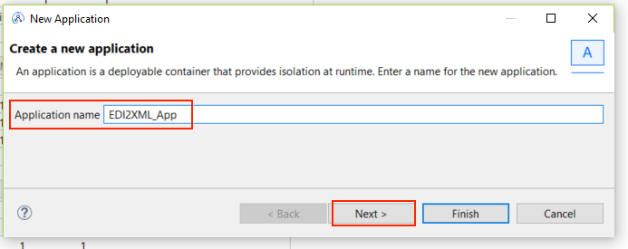

- Dodaj biblioteki ze schematem DFDL wiadomości EDIFACT i kliknij **Finish**.

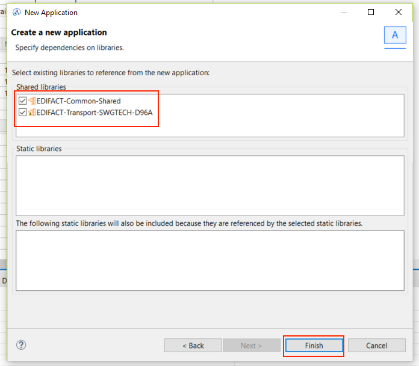

- W powstałej aplikacji kliknij **(New..)**, a następnie **Message Flow**.

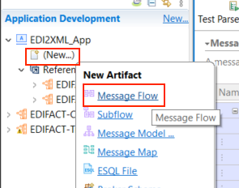

- Nazwij przeływ: `EDI2XML_MsgFlow`.


2. Konfiguracja węzła **FileInput**:

- W zakładce Palette w komórce `<Search>` wpisz `file`. Pojawią się węzły związane z przetwarzaniem plików.
- Kliknij **FileInput**, a następnie najedź kursorem na wolną przestrzeń po prawej stronie i kliknij ponownie lewym przyciskiem myszy. W ten sposób dodałeś węzeł **FileInput** do projektu przepływu.


- Kliknij na węzeł i przejdź do zakładki *Basic*.
- W wierszu *Input directory* kliknij **Browse...** i wybierz folder `<path-to-labfile>/labfiles/tmp`. Kliknij **Select Folder**.


- W tej samej zakładce zdefiniuj *File name or pattern* jako `*.edi` i przejdź do zakładki *Input Message Parsing*.


- W zakładce *Input Message Parsing* w *Message domain* wybierz **DFDL**.
- W *Message model* wybierz **EDIFACT-Transport-SWGTECH-D96A**.
- W *Message* wybierz **Interchange**.

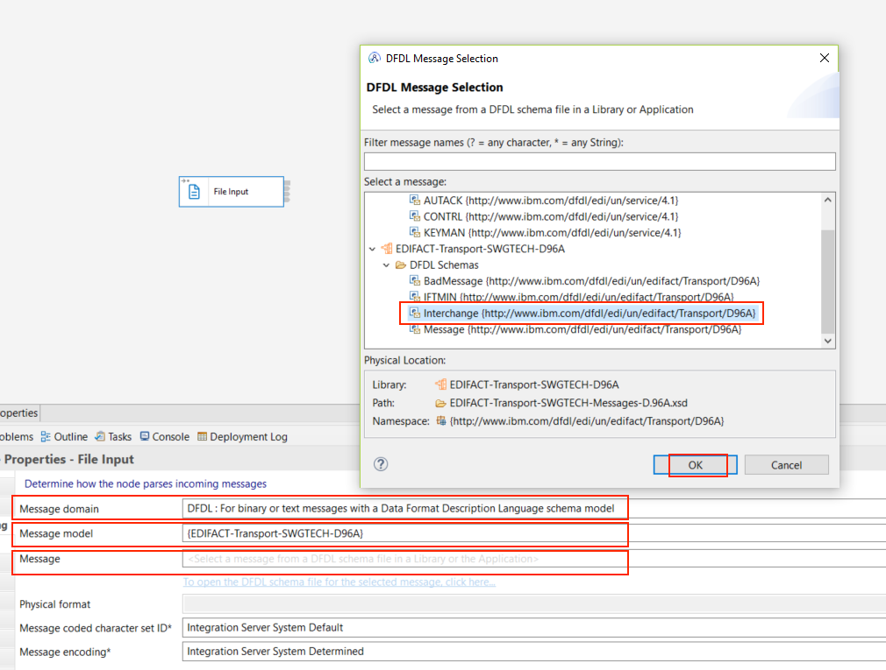

- Przejdź do zakładki *Records and Elements* i ustaw *Record detection* na **Parsed Record Sequence**.


3. Konfiguracja węzła **Mapping**:

- W zakładce Palette w komórce `<Search>` wpisz `mapp`. Pojawią się węzły **Mapping**.
- Kliknij **Mapping**, a następnie najedź kursorem na wolną przestrzeń po prawej stronie od węzła **FileInput** i kliknij ponownie lewym przyciskiem myszy.

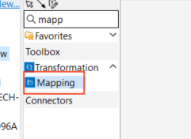

- Kliknij dwukrotnie na węzeł **Mapping**, aby skonfigurować mapowanie wiadomości.
- Pozostaw ustawienia domyślne i kliknij **Next**.

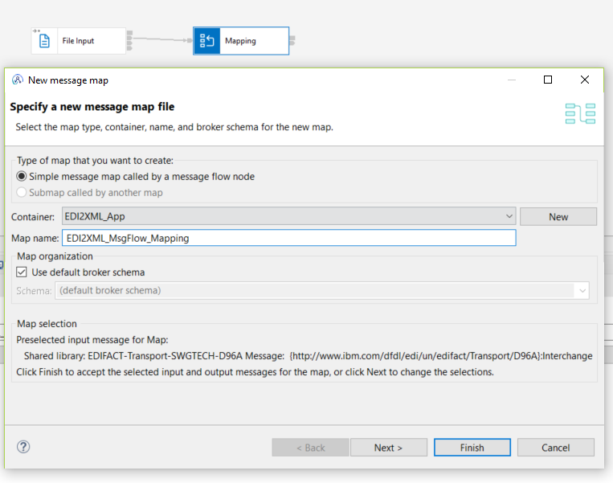

- Wybierz modele danych wiadomości wejściowej: **Interchange** (EDIFACT) oraz wiadomości wyjściowej: **TransactionInstruction** (XML).


Schemat XML (`**EDIFact2XMLSchema_v1.xsd**`) jest modelem danych przykładowego, uproszczonego komunikatu XML **TransactionInstruction**. Został on stowrzony na potrzeby tego ćwiczenia. Wygląda on następująco:

```xml
<?xml version="1.0" encoding="UTF-8" standalone="no"?>
<xsd:schema xmlns:xsd="http://www.w3.org/2001/XMLSchema">
<xsd:element name="InterchangeHeader" type="Header"></xsd:element>
    <xsd:complexType name="Header">
    	<xsd:sequence>
    		<xsd:element name="InterchangeSender" type="xsd:string"></xsd:element>
    		<xsd:element name="InterchangeRecipient" type="xsd:string"></xsd:element>
    		<xsd:element name="DateOfPreparation" type="xsd:string"></xsd:element>
    	</xsd:sequence>
    </xsd:complexType>
<xsd:element name="Message" type="Message"></xsd:element>
    <xsd:complexType name="Message">
    	<xsd:sequence>
    		<xsd:element name="MessageType" type="xsd:string"></xsd:element>
    		<xsd:element name="DocumentMessageNameCoded"
    			type="xsd:string">
    		</xsd:element>
    		<xsd:element name="DateTimePeriod " type="xsd:string"
    			maxOccurs="unbounded" minOccurs="0">
    		</xsd:element>
    		<xsd:element name="ServiceRequirementCoded"
    			type="xsd:string" maxOccurs="unbounded" minOccurs="0">
    		</xsd:element>
    		<xsd:element name="ControlTotal" type="Control" maxOccurs="unbounded" minOccurs="0"></xsd:element>
    	</xsd:sequence>
    </xsd:complexType>

    <xsd:complexType name="Control">
    	<xsd:sequence>
    		<xsd:element name="ControlQualifier" type="xsd:string"></xsd:element>
    		<xsd:element name="ControlValue" type="xsd:double"></xsd:element>
    		<xsd:element name="MeasureUnitQualifier" type="xsd:string"></xsd:element>
    	</xsd:sequence>
    </xsd:complexType>

    <xsd:element name="InterchangeTrailer" type="Trailer"></xsd:element>
    
    <xsd:complexType name="Trailer">
    	<xsd:sequence>
    		<xsd:element name="InterchangeControlReference" type="xsd:string"></xsd:element>
    	</xsd:sequence>
    </xsd:complexType>

    <xsd:element name="TransactionInstruction" type="Transaction"></xsd:element>
    
    <xsd:complexType name="Transaction">
    	<xsd:sequence>
    		<xsd:element name="InterchangeHeader" type="Header"></xsd:element>
    		<xsd:element name="Message" type="Message"></xsd:element>
    		<xsd:element name="InterchangeTrailer" type="Trailer"></xsd:element>
    	</xsd:sequence>
    </xsd:complexType>
</xsd:schema>
```

Wykorzystamy ten model danych jako docelowy format wiadomości wyjściowej.

- Połącz odpowiednie pola z modelu **Interchange** (EDIFACT) z polami z modelu **TransactionInstruction** (XML) zgodnie z tabelą poniżej:

| **Interchange** (EDIFACT)  | **TransactionInstruction** (XML) |
| ------------- | ------------- |
| Interchange-UNB-S002-E0004-InterchangeSender  | InterchangeHeader-InterchangeRecipient |
| Interchange-UNB-S003-E0010-InterchangeRecipient | InterchangeHeader-InterchangeSender |
| Interchange-UNB-S004-E0017-Date | InterchangeHeader-DateAndTimeOfPreparation |
| Message-UNH-S009-E0065-MessageType | Message-MessageType |
| Message-IFTMIN-BGM-C002-E1001-DocumentMessageNameCoded | Message-DocumentMessageNameCoded |
| Message-IFTMIN-DTM-C507-E2380-DateTimePeriod | Message-DateTimePeriod |
| Message-IFTMIN-TSR-C233-E7273a-ServiceRequirementCoded | Message-ServiceRequirementCoded |
| Message-IFTMIN-CNT-ControlTotal | Message-ControlTotal |
| (w ControlTotal) C270-E6069-ControlQualifier | ControlQualifier |
| (w ControlTotal) C270-E6066-ControlValue | ControlValue |
| (w ControlTotal) C270-E6411-MeasureUnitQualifier | MeasureUnitQualifier |
| UNZ-E0020-InterchangeControlReference | InterchangeTrailer-InterchangeControlReference |

<details>
<summary><b><font color="dodgerblue">Kliknij, aby otowrzyć:</font></b> Instrukcja połączenia poszczególnych komponentów "**Mapy**"</summary>

1. Połączenia w sekcji **InterchangeHeader**.


2. Połączenia w sekcji **Message**. 

- Kliknij na `quick fix` (ikona "żarówki"): "Set cardinality to first index".

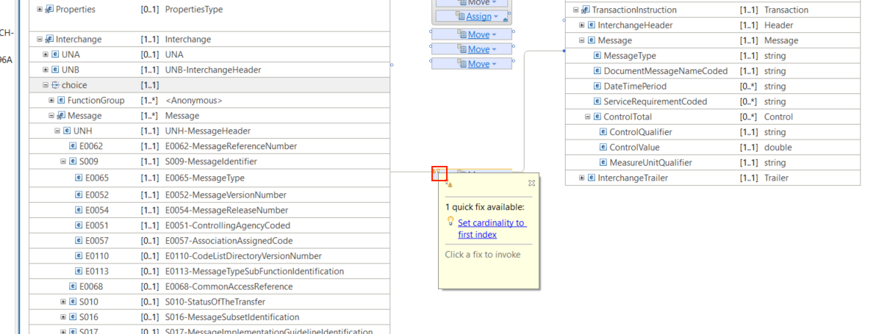

- Dla połączeń typu `For each` wejdź do mapy "zagnieżdżonej".


- Wróć do mapy "głównej"


3. Połączenia w sekcji **InterchangeTrailer**.


</details>

- Zapisz **Mapę**, klikając **Ctrl + S**
- Wróć do zakładki przepływu i zapisz przepływ,klikając **Ctrl + S**.

## Konfoguracja MQ

## Tworzenie aplikacji integracyjnej EDI2XML_App c.d.