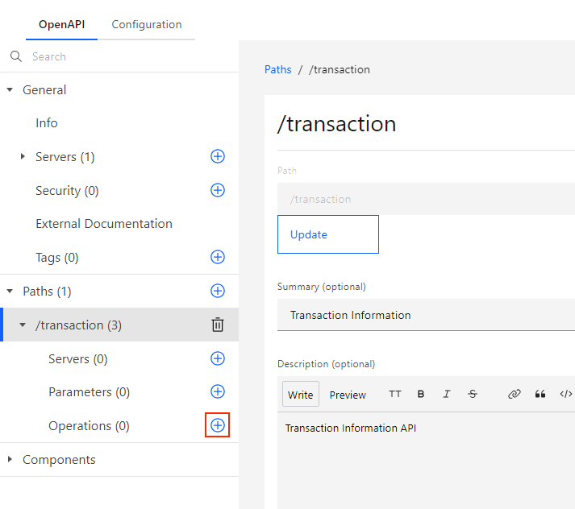
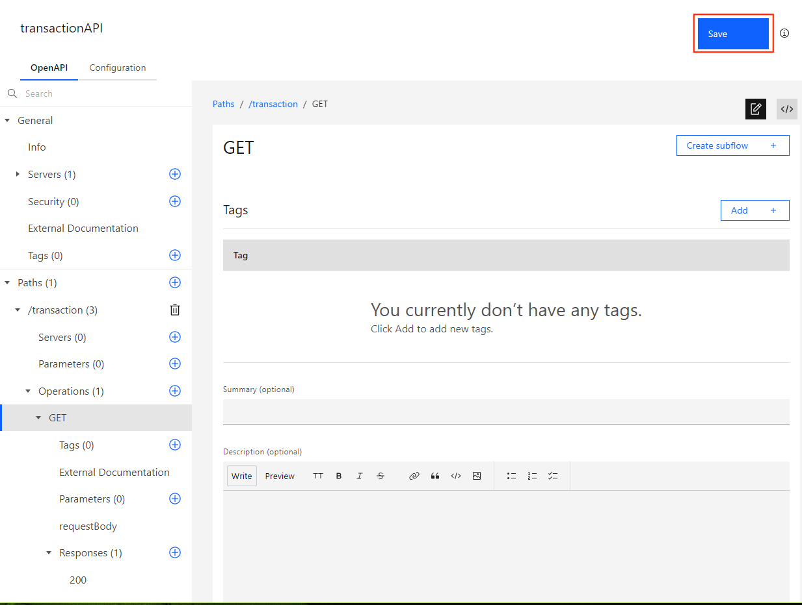
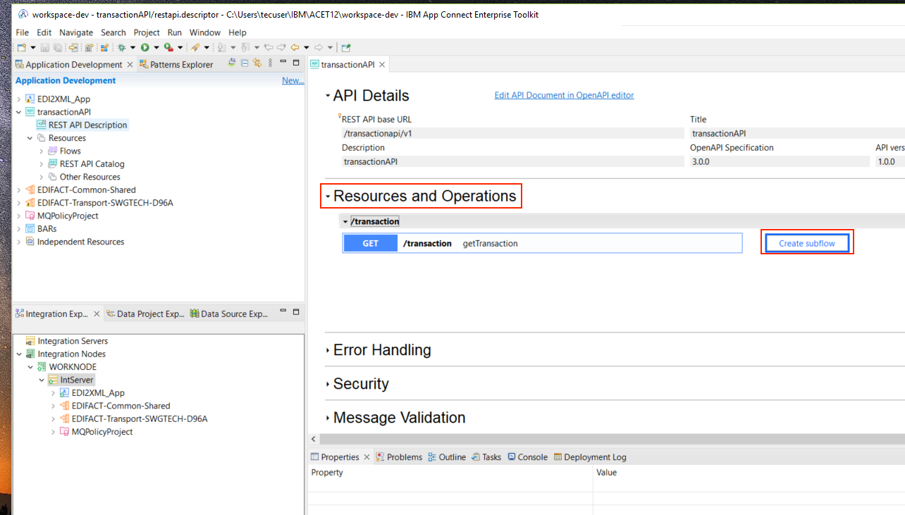
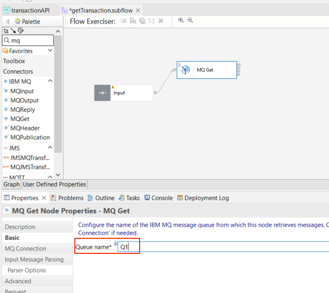
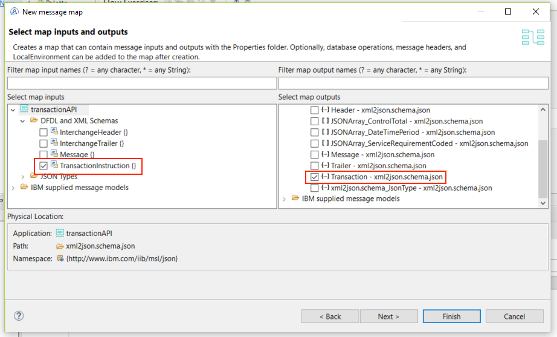
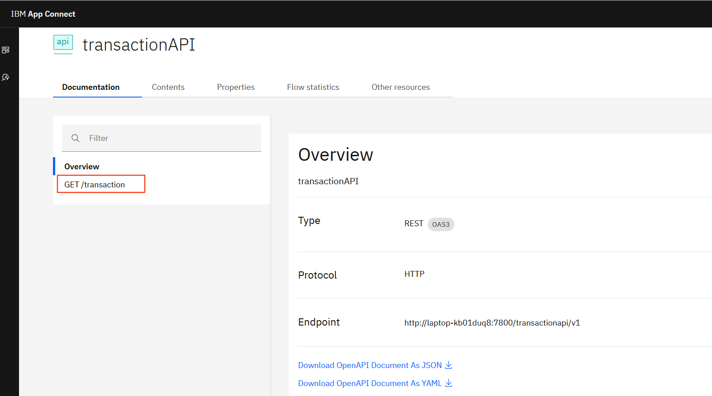
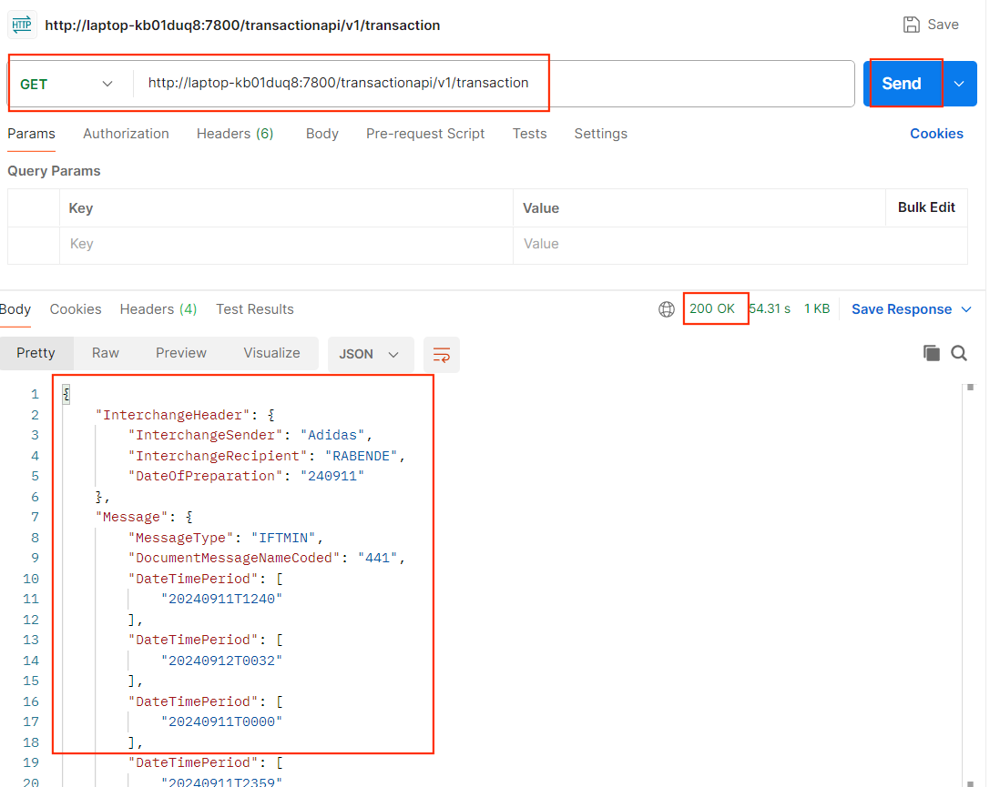

# Tworzenie aplikacji REST API – transactionAPI

## Czas ćwiczenia

00:30

## Opis ćwiczenia

W tym ćwiczeniu stworzysz aplikacje REST API transactionAPI, gdzie zdefiniujesz prostą operację `GET` dla API `/transaction`. Definicje OpenAPI (v3) operacji stworzysz wykorzystując intuicyjne narzędzie *OpenAPI Editor*. W następnym kroku zaimplementujesz przepływ wiadomości, który zostanie zainicjowany po wywołaniu operacji `GET`. Przepływ pobierze wiadomość z wcześniej skonfigurowanej kolejki Q1 w formacie XML wykorzystując węzeł *MQ Get*, a nastepnie wykona mapowanie wiadomości na format JSON.

## Cele

Po ukończeniu tego ćwiczenia powinieneś potrafić:
- Stworzyć aplikacje REST API.
- Implementować operacje `GET` w REST API z wykorzystaniem subflow.
- Użyć węzła *Mapping* do mapowania wiadomości w formacie XML do formatu JSON.
- Skonfigurować węzeł *MQGet*, aby odebrać wiadomość z kolejki.

## Wstęp

Firma logistyczna chce udostępnić REST API dt. transakcji, które otrzymuje od swoich partnerów biznesowych. W tym celu chce wykorzysztać system kolejkowy MQ, gdzie umieszczane są wiadomości w formacie XML dt. transakcji. Operacja REST API ma pobierać transakcje dostępne w kolejce i wyświetlać je w formacje JSON, potrzebnym do daleszgo przetwarzania transakcji.

## Wymagania

- Środowisko warsztatowe z zainstalowanym [IBM App Connect Enterprise Toolkit (ACET)](https://www.ibm.com/docs/en/app-connect/12.0?topic=enterprise-download-ace-developer-edition-get-started).
- Środowisko warsztatowe z zainstalowanym [IBM MQ Server](https://www.ibm.com/docs/en/ibm-mq/9.3?topic=windows-installing-server-using-launchpad) oraz [IBM MQ Explorer](https://www.ibm.com/docs/en/ibm-mq/9.3?topic=windows-installing-stand-alone-mq-explorer).
- Pobrany i rozpakowany folder z plikami potrzebnymi do ćwiczeń laboratoryjnych - [labfiles](https://github.com/jawor96/Warsztaty_CP4I/tree/main/labfiles).
- Dostęp do narzędzia do testowania komunikacji (Postman lub SoapUI).

## Przygotowanie środowiska

Uruchom aplikacje IBM App Connect Toolkit.

1.	Kliknij w Search w pasku narzędzi i wyszukaj aplikacji IBM App Connect Enterprise Toolkit 12.
2.	Kliknij w aplikacje, aby ją uruchomić.

3.	Zostaw domyślny **Workspace**: `<path-to-ACE>\IBM\ACET12\workspace` i kliknij **Launch**. Aplikacja ACET uruchomi się po chwili.

## Tworzenie aplikacji REST API transactionAPI

1. Stórz nowy projetk aplikacji REST API:

- Kliknij **New..**, a następnie **REST API**.

- Nazwij aplikacje `transactionAPI`, wybierz opcje *Create a REST API ...* (pozostaw wartości domyślne) i kliknij **Finish**.

- Pojawi się strona REST API Description w głównym oknie Toolkit.  
- W górnej części strony, w sekcji *API Details* znajduje się link do **Edit API Document in OpenAPI Editor**. Kliknij to łącze.

2. Po chwili otworzy sie edytor OpenAPI. Menu nawigacyjne znajduje się po lewej stronie okna, które ma funkcję wyszukiwania, a poniżej ma oddzielne sekcje dla każdej części dokumentu najwyższego poziomu o nazwach General, Paths i Components.

- Kliknij ikonę "**+**" przy *Paths*, aby dodać API `transaction`.

- Uzupełnij pola zgodnie z tabelą i kliknij **Add**.

| Pole  | Wartość |
| ------------- | ------------- |
| Path  | `/transaction` |
| Summary | `Transaction Information` |
| Description | `Transaction Information REST API` |

- Kliknij ikonę "**+**" przy *Operations*, aby dodać operacje `GET`.

- Stowrzyłeś prosta operację `GET`. Zapisz zamiany klikając **Save** i zamknij edytor OpenAPI.

- Wróć do narzędzia ACET.

## Implementacja operacje GET w REST API z wykorzystaniem subflow.

1. Na stronie REST API rozwiń zakładkę *Resources and Operations*. Kliknij **Create subflow** obok operacji `GET`, aby stowrzyć przepływ operacji.

- Otowrzy się widok przepływu z węzłami **Input** oraz **Output**.

3. Dodaj węzeł **MQ Get** do przepływu wyszukując go w *Palette*. Jest to węzeł, który pobierze wiadomość z kolejki.

- Połącz terminal **Out** węzła **Input** z terminalem **In** węzła **MQ Get**.
- Kliknij na węzeł **MQ Get** i przejdź do zakładki *Basic*. Wpisz w *Queue name* nazwę kolejki stowrzonej w poprzednim ćwiczeniu (LAB2): `Q1`.

- Przejdź do zakładki *Advance* i uzupełnij parametry zgodnie z obrazkiem poniżej:

- Przejdź do zakładki *Input Message Parsing* i wybierz *Message domain*: `XMLNSC`.

- Przejdź do zakładki *Policy* i wybierz *Policy*: `MQPolicy` (stworzoną w poprzednim ćwiczeniu).

4. Dodaj węzeł **MQ Header** do przepływu wyszukując go w *Palette*. Jest to węzeł, który usunie niepotrzebne w naszym przypadku nagłówki wiadomości dodane przez MQ.

- Połącz terminal **Out** węzła **MQ Get** z terminalem **In** węzła **MQ Header**.
- Kliknij na węzeł **MQ Header** i przejdź do zakładki *MQMD*. Wybierz opcje: `Delete header`.

- Przejdź do zakładki *MQDLH*. Wybierz opcje: `Delete header`.

5. Dodaj węzeł **Mapping** do przepływu wyszukując go w *Palette*. Wykona on transformacje danych z formatu XML do JSON.

- Połącz terminal **Out** węzła **MQ Header** z terminalem **In** węzła **Mapping**.
- Połącz terminal **Out** węzła **Mapping** z terminalem **In** węzła **Output**.

6. Zanim przejdziesz do konfiguracji, należy dodać modele danych, które wykorzystasz do mapowania danych z formatu XML do formatu JSON.
7. Aby dodać model danych JSON, kliknij prawym przyciskiem myszy na projekt aplikacji.

- Kliknij **New** > **Message Model**

- Wybierz opcje **Other JSON** i kliknij **Next**.
- Wybierz opcję *I already have a JSON schema file for my data* i kliknij **Next**.

- Wybierz schemat: `xml2json.schema.json`, który znajduje się w folderze `<path-to-labfiles>/labfiles` i kliknij **Open**.

Model danych, który załadowałeś jest odwzorowaniem schematu XML *TransactionInstruction* w formacie JSON. Możesz podejrzeć jego strukturę klikając na niego dwa razy.

7. Powtórz procedurę dodawania model danych dla schematu XML. Kliknij prawym przyciskiem myszy na projekt aplikacji.

- Kliknij **New** > **Message Model**

- Wybierz opcje **Other XML** i kliknij **Next**.
- Wybierz opcję *I already have a XML schema file for my data* i kliknij **Next**.

- Wybierz schemat: `EDIFact2XMLSchema_v1.xsd`, który znajduje się w folderze `<path-to-labfiles>/labfiles` i kliknij **Open**.

8. Jesteś gotowy, aby skonfigurować mapę do transformacji formatów. Kliknij dwa razy na węzeł **Mapping**.

- Wybierz: *Simple message map called by message flow node* i kliknij **Next**.

- Jako format wejściowy wybierz: `TransactionInstruction {}`, a jako format wyjściowy wybierz: `{...} Transaction`.

- Kliknij **Finish**.
- Skonfiguruj połączenia poszczególnych elementów zgodnie z odpowiadającymi nazwami (patrz obrazek poniżej).

- Dla funkcji **For each** skonfiguruj "zagnieżdżone" mapowanie zgodnie z obrazkami poniżej.

## Testowanie aplikacji REST API – transactionAPI

1. Aby prztestować API, należy wdrożyć aplikacje **transactionAPI** na serwer **IntServer**.

- Kliknij prawym przycieskiem myszy na projekt, a następnie kliknij **Deploy** i wybierz serwer integracyjny **IntServer**.

2.  Po wdrożeniu aplikacji, kliknij prawym przyciskiem myszy na węzeł integracyjny **WORKNODE** i kliknij *Start Web User Interface*.

> [!NOTE]
> Internetowy interfejs użytkownika IBM App Connect Enterprise umożliwia użytkownikom dostęp do zasobów serwera integracji za pomocą przeglądarki internetowej i zapewnia administratorom integracji metodę administrowania tymi zasobami.
>
> Z poziomu internetowego interfejsu użytkownika można wykonywać następujące zadania administracyjne:
> 
> - Wyświetlanie serwerów integracji i zasobów serwerów integracji oraz zarządzanie nimi, np. wdrażanie plików BAR aplikacji oraz zatrzymywanie, uruchamianie lub usuwanie wdrożonych aplikacji.
> - Tworzenie polityk operacyjnych i zarządzanie nimi.
> - Praca ze statystykami i danymi rozliczeniowymi dla przepływów wiadomości.
> - Praca ze statystykami dotyczącymi zasobów używanych przez serwery integracji.
> - Uruchamianie i zatrzymywanie śledzenia użytkowników i usług.
> - Push (eksportowanie) definicji jednego lub więcej wdrożonych interfejsów API REST do IBM API Connect.
> - Tworzenie definicji transakcji biznesowych i monitorowanie transakcji biznesowych.

- Wejdź w serwer integracyjny **IntServer**, a następnie przejdź do aplikacji **transaction API**.
- W widoku aplikacji kliknij operacje `GET /transaction`.

- Skopiuj link "endpoint" operacji `GET`.

3. Przejdź do narzędzia **Postman** i dodaj nową operację `GET`.

- Wklej skopiowany link i kliknij **Send**.

- Powinieneś otrzymać odpowiedź w formacie JSON z kodem **200**.

> [!IMPORTANT]
> Jeśli nie otrzymałeś żadnej odpowiedzi, może to oznaczać, że w kolejce Q1 nie ma wiadomości, którą można pobrać. Aby uzupełnić kolejkę skopiuj plik `testedi.edi` i wklej go poniwnie w folderze `tmp`. Aplikacja monitorująca folder nadal jest uruchomiona na serwerze (z poprzedniego ćwiczenia), więc pobierze wiadomość do kolejki. Po wrzuceniu komunikatu do kolejki Q1, powtórz operacje `GET` w narzędziu Postman.

-  Możesz prześledzieć statyski przetworzonych wiadomości w WebUI ACE, klikając zakładkę *Flow statistic*.

> [!NOTE]
> Poświęc trochę czasu na eksploracje WebUI ACE.

***KONIEC ĆWICZENIA - Gratulacje!***

## Podsumowanie

Podczas wykonywania ćwiczenia stworzyłeś prostą aplikacje REST API. Wykorzystałeś edytor *OpenAPI* do definicji operacji `GET`. Zaimplementowałeś przepływ wiadomości, który jest wykonywany po wywołaniu API. Wykorzystałeś węzeł *Mapping*, aby zmapować format XML na format JSON. Użyłeś węzłów *MQ Get*, aby pobrać komunikat z kolejki. Dodatkowo poznałeś WebUI ACE do administracji zasobami.
