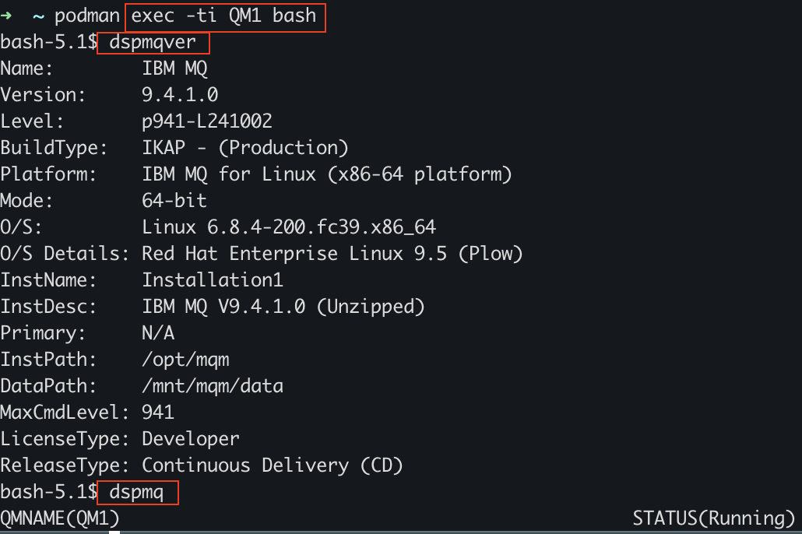
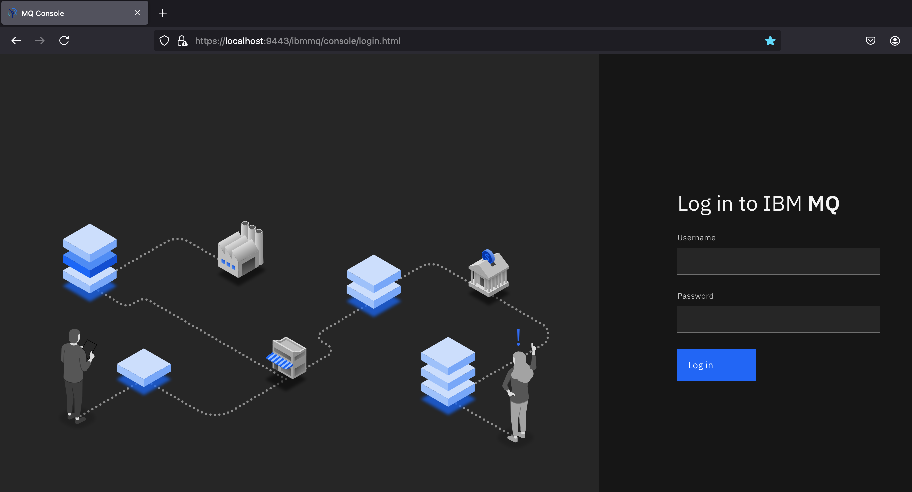
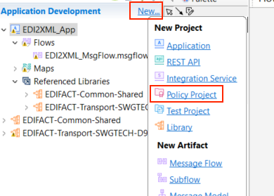
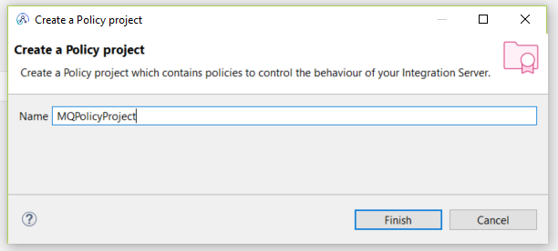
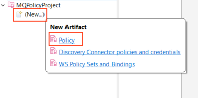
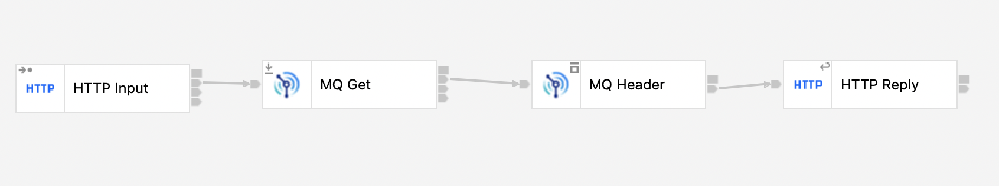

# Konfiguracja MQ w środowisku kontenerowym

## Czas ćwiczenia

01:00

## Opis ćwiczenia

W tym ćwiczeniu stworzysz i skonfigurujesz menedżera kolejek (Queue Manager) w kontenerze. Następnie umieścisz w kolejce wiadomość wykorzystując konsolę **IBM MQ Console**. W kolejnym kroku stowrzysz "security identity" i politykę `MQPolicy` w ACET. Na koniec ćwiczenia stworzysz prostą aplikacje integracyjną z przepłwem, który wrzuca wiadomosć do kolejki MQ oraz przeplywem, który wyciąga wiadomość z kolejki MQ.

## Cele

Po ukończeniu tego ćwiczenia powinieneś potrafić:
- Stworzysz i skonfigurować QM w kontenerze.
- Poruszać się w IMB MQ Console.
- Skonfigurować połączenie między MQ i ACE.
- Wrzucić i pobrać wiadomość z kolejki MQ.

## Wymagania

- Środowisko warsztatowe z zainstalowanym [IBM App Connect Enterprise Toolkit (ACET)](https://www.ibm.com/docs/en/app-connect/12.0?topic=enterprise-download-ace-developer-edition-get-started).
- [Podman](https://podman.io/getting-started/installation) lub [Docker](https://docs.docker.com/get-docker/).
- Dostęp do narzędzia do testowania komunikacji (Postman lub SoapUI).

## Konfiguracja menedżera kolejek w kontenerze

### Pobierz obraz kontenera MQ

Kontenery są uruchamiane z obrazów, a obrazy są tworzone na podstawie specyfikacji podanej w pliku Dockerfile. Użyjemy wstępnie zbudowanego obrazu serwera IBM MQ, abyśmy mogli uruchomić nasz kontener bez konieczności budowania obrazu. Ostatecznie otrzymamy działającą instalację MQ i menedżera kolejek, który jest wstępnie skonfigurowany z obiektami gotowymi do pracy dla programistów.

1. Pobierz obraz z *IBM Container Registry*, który zawiera najnowszą wersję serwera MQ.

```
podman pull icr.io/ibm-messaging/mq:latest
```

2. Po zakończeniu sprawdź, jakie obrazy są dostępne.

```
podman images | grep mq
```


### Uruchomienie kontenera MQ z obrazu.

Teraz, gdy obraz serwera MQ znajduje się w lokalnym repozytorium obrazów, można uruchomić kontener.

Podczas konfigurowania kontenera używany jest system plików w pamięci kontenera, który jest usuwany po usunięciu kontenera. Dane menedżera kolejek i kolejek są zapisywane w tym systemie plików. Aby uniknąć utraty danych menedżera kolejek i kolejek, możemy użyć **Volumes**.

**Volumes** są dołączane do kontenerów podczas ich uruchamiania i utrzymują się po usunięciu kontenera. Po uruchomieniu nowego kontenera można dołączyć istniejący wolumin, a następnie ponownie użyć menedżera kolejek i danych kolejki.

1. Aby stowrzyć **Volume** wykonaj polecenie:

```
podman volume create qm1data
```

2. Uruchom kontener serwera MQ.

Edytując polecenie możesz ustawić własne hasło do łączenia się z aplikacjami. Hasło to będzie potrzebne później, zarówno dla demonstracyjnej aplikacji klienckiej, jak i podczas uruchamiania własnych aplikacji klienckich. W tym przykładzie ustawiamy hasło na „passw0rd”, ale można też wybrać własne.

```
 podman run --env LICENSE=accept --env MQ_QMGR_NAME=QM1 --volume qm1data:/mnt/mqm --publish 1414:1414 --publish 9443:9443 --detach --env MQ_APP_USER=app --env MQ_APP_PASSWORD=passw0rd --env MQ_ADMIN_USER=admin --env MQ_ADMIN_PASSWORD=passw0rd --name QM1 icr.io/ibm-messaging/mq:latest
```

Twój menedżer kolejek został skonfigurowany z prostą domyślną konfiguracją, aby umożliwić podłączenie pierwszej aplikacji klienckiej.

Dodaliśmy kilka parametry do polecenia run np. akceptacja licencji na IBM MQ Advanced dla deweloperów i nazwać menedżera kolejek **QM1**, w którym będzie znajdować się nasza kolejka.

Ponieważ MQ działa wewnątrz kontenera, będzie odizolowany od reszty świata, więc otworzyliśmy kilka portów używanych przez MQ.

Listener menedżera kolejek nasłuchuje na porcie 1414 dla połączeń przychodzących, a port 9443 jest używany przez konsolę MQ.

3. Daj kontenerowi chwilę na uruchomienie, a następnie sprawdź, czy działa.

```
podman ps
```


Gratulacje! Właśnie stworzyłeś swój pierwszy prosty menedżer kolejek. Nazywa się QM1 i działa wewnątrz kontenera.

Na tym etapie możesz dostac się do menedżer kolejek (QM1) łącząc się do niego po TCP/IP po porcie 1414. 

4. Aby dostać sie do kontenera wykonaj komendę:

```
podman exec -ti QM1 bash
```
5. Ścieżki instalacji i danych MQ można wyświetlić, uruchamiając polecenie `dspmqver` w wierszu poleceń.
6. Uruchomione menedżery kolejek można wyświetlić za pomocą polecenia `dspmq`.



7. Aby wyjść z kontenera Docker i powrócić do wiersza poleceń, wpisz `exit` i naciśnij `Enter`.


### Podsumowanie etapu

Pobrałeś wstępnie zbudowany obraz MQ i uruchomiłeś go w kontenerze. Obiekty IBM MQ i uprawnienia, których aplikacje klienckie potrzebują do łączenia się z menedżerem kolejek oraz do wysyłania i odbierania wiadomości z i do kolejki zostały stworzone automatycznie. Podman i MQ korzystają z zasobów hosta i łączności lokalnej maszyny.

Wewnątrz kontenera instalacja MQ ma następujące obiekty:

- Menedżer kolejek QM1
- Kolejka DEV.QUEUE.1
- Kanał: DEV.APP.SVRCONN
- Listener: SYSTEM.LISTENER.TCP.1 na porcie 1414

Kolejka, która będzie używana, DEV.QUEUE.1, działa w menedżerze kolejek QM1. Menedżer kolejek ma również listener, który nasłuchuje połączeń przychodzących na porcie 1414. Aplikacje klienckie mogą łączyć się z menedżerem kolejek i mogą otwierać, umieszczać i pobierać wiadomości oraz zamykać kolejkę.

Aplikacje używają kanału MQ do łączenia się z menedżerem kolejek. Dostęp do tych trzech obiektów jest ograniczony na różne sposoby. Na przykład użytkownik „app”, który jest członkiem grupy „mqclient”, może używać kanału DEV.APP.SVRCONN do łączenia się z menedżerem kolejek QM1 i jest upoważniony do umieszczania i pobierania wiadomości do i z kolejki DEV.QUEUE.1.

Wszystkie obiekty MQ i uprawnienia, których potrzebuje aplikacja kliencka, są tworzone i konfigurowane podczas uruchamiania kontenera serwera MQ.


## Wykorzystanie IBM MQ Console

Konsola MQ (**IBM MQ Console**) to interfejs użytkownika w przeglądarce, który umożliwia wizualizację i zarządzanie obiektami MQ, w tym menedżerami kolejek i kolejkami. Można w nim tworzyć menedżery kolejek i kolejki, przeglądać wiadomości, ustawiać uprawnienia i właściwości oraz wiele więcej.

Administratorzy używają konsoli MQ do administrowania menedżerami kolejek. Programiści mogą używać konsoli MQ do testowania i debugowania aplikacji klienckich.

### Dostęp do IBM MQ Console

1. Przejdź na stronę https://localhost:9443/ibmmq/console

Przeglądarka wyświetli ostrzeżenie o niebezpiecznym połączeniu. Dzieje się tak dlatego, że serwer z uruchomionym MQ domyślnie używa certyfikatu z podpisem własnym, więc można zaakceptować ostrzeżenie i przejść do konsoli. (Jeśli wolisz dostarczyć do przeglądarki własny certyfikat z podpisem własnym lub CA, zapoznaj się z [tym artykułem IBM Docs](https://www.ibm.com/docs/en/ibm-mq/latest?topic=mcras-using-client-certificate-authentication-rest-api-mq-console&utm_source=ibm_developer&utm_content=in_content_link&utm_id=tutorials_mq-setting-up-using-ibm-mq-console&cm_sp=ibmdev-_-developer-tutorials-_-ibmcom)).



2. Po potwierdzeniu w przeglądarce, że chcesz kontynuować, zostaniesz przeniesiony na stronę logowania, która poprosi o podanie nazwy użytkownika i hasła.

```
Username: admin
Password: passw0rd
```

### Wyświetlanie i edytowanie obiektów MQ za pomocą konsoli MQ

Wewnątrz konsoli można wyświetlać i edytować wszystkie menedżery kolejek IBM MQ, kanały i inne obiekty. Za pomocą konsoli MQ można również tworzyć nowe kolejki, ustawiać uprawnienia dla różnych użytkowników i obiektów, przeglądać przepływy komunikatów i monitorować kondycję środowiska IBM MQ. Pełny opis konsoli MQ jest dostępny w [tym artykule IBM Docs](https://www.ibm.com/docs/en/ibm-mq/latest?topic=administering-administration-using-mq-console&utm_source=ibm_developer&utm_content=in_content_link&utm_id=tutorials_mq-setting-up-using-ibm-mq-console&cm_sp=ibmdev-_-developer-tutorials-_-ibmcom), ale tutaj omówimy kilka podstawowych czynności.

1. Na stronie głównej konsoli MQ wybierz opcję `Manage`, aby otworzyć listę menedżerów kolejek. W tym miejscu można je tworzyć lub nimi zarządzać.


2. Wybranie menedżera kolejek, takiego jak **QM1**, spowoduje wyświetlenie kolejek i innych obiektów powiązanych z tym menedżerem kolejek, jak na poniższym obrazku.


3. W tym miejscu klikając `Create`, możesz utworzyć własne kolejki. Możesz także zobaczyć wiadomości w istniejących kolejkach, wybierając pojedynczą kolejkę (np. `DEV.QUEUE.1`).
4. Możesz umieścić wiadomość w tej kolejce, klikając `Create` na tej stronie, co  oznacza „utwórz nową wiadomość”. Pole `Application data` zawiera treść wiadomości. Kliknięcie przycisku `Create` powoduje umieszczenie wiadomości w kolejce.


5. Kliknięcie wiadomości spowoduje wyświetlenie "szczegółów wiadomości", które zapewniają więcej informacji na temat jej właściwości.


## Konfiguracja polityki komunikacyjnej między MQ i ACET

### Tworzenie "security identity" MQ

Podczas konfigurowania połączenia MQ z węzła MQ do menedżera kolejek IBM MQ można opcjonalnie skonfigurować połączenie tak, aby używało tożsamości zabezpieczeń do uwierzytelniania. Tożsamość zabezpieczeń, która przekazuje nazwę użytkownika i poświadczenia bezpieczeństwa hasła do menedżera kolejek, może być używana w połączeniach z lokalnymi lub zdalnymi menedżerami kolejek.

Można użyć właściwości `security identity` w węźle MQ lub polityce MQEndpoint (w dalszej cześci ćwiczenia), aby przekazać nazwę użytkownika i hasło do menedżera kolejek, określając tożsamość zabezpieczeń, która zawiera te poświadczenia. Tożsamość jest definiowana za pomocą polecenia `mqsisetdbparms`.

1. Otwórz konsole ACE, klikając w *Search* w pasku narzędzi i wpisując `App Connect`, a następnie klikając prawym przyciskiem myszy na aplikacje **IBM App Connect Enterprise Console** i kliknij **Rus as administrator**.


2. Aby stowrzyć **security identity**, wpisz komendę:

```
mqsisetdbparms -w <workDir> -n mq::MqIdentity -u admin -p passw0rd
```


> [!NOTE]
> `workDir` to katalog roboczy serwera integracyjnego, np. `/Users/ace_user/ibm/ACET12/workspace/MQtest/IntegrationServer`, gdzie `IntegrationServer` to nazwa serwera integracyjnego.

3. Wróc do ACET i zresetuj serwer integracyjny, aby zastosować zmiany.

### Konfiguracja MQ Policy

W nastepnym kroku stworzymy projekt polityki MQ, aby kontrolować wartości konfiguracje połączenia węzła MQ.

1. Wróć do narzędzia ACET i kliknij **New...**, a następnie dodaj **Policy Project**.



- Nazwij projekt `MQPolicyProject`, a następnie kliknij **Finish**.



2. Stwórz politykę, klikająć **(New..)** i **Policy**.



- Nazwij projekt `MQPolicy`, a następnie kliknij **Finish**.
- Wybierz **Type** polityki: `MQEndpoint`.
- Wybierz **Template** polityki: `MQEndpoint`.
- Pojawi się szablon, który wypełnij zgodnie z tabelą ponieżj:

| Property  | Value |
| ------------- | ------------- |
| Connection  | SERVER |
| Queue manager name | QM1 |
| Queue manager host name | localhost |
| Listener port number | 1414 |
| Channel name | DEV.ADMIN.SVRCONN |
|Security identity (DSN) | MqIdentity |


Reszte pozycji pozostaw bez zmian.

3. Zapisz politykę, a następnie wdroż ją na serwer.
4. Aby wdrożyć projekt polityki MQ, należy kliknąć prawym przycieskiem myszy na projekt, a następnie kliknij **Deploy** i wybierz serwer integracyjny.

## Tworzenie prostej aplikacji MQDemoApp

1. Stwórz projekt aplikacji i nazwij go `MQDemoApp`.

### Przepły integracyjny wrzucający wiadomość do kolejki

1. W aplikacji MQDemoApp kliknij **(New…)**, a następnie **Massage Flow**.
2. W **Massage flow** name wpisz: `MQMsgFlowIn`, a następnie **Finish**

Stworzysz prosty przepływ integracyjny, który przyjmie wiadomość po HTTP i wrzuci ją do skonfigurowanej w poprzenim ćwiczenia kolejki MQ w menadżeże kolejek QM1.

3. Dodaj węzły integracyjne: **HTTP Input**, **MQ Output** oraz **HTTP Reply**, a następnie połączje ze sobą zgodnie z obrazkiem poniżej:


4. W węźle HTTP Input skonfiguruj `Path suffix for URL:` jako `/mqin`.
5. W węźle MQ Output skonfiguruj:

- **Queue name**: `DEV.QUEUE.1` (Basic)
- **Policy**: `MQPolicyProject` (Policy)

6. Zapisz przepły, a następnie wdroż ją na serwer.

### Przepły integracyjny pobierający wiadomość z kolejki

1. W aplikacji MQDemoApp kliknij **(New…)**, a następnie **Massage Flow**.
2. W **Massage flow** name wpisz: `MQMsgFlowOut`, a następnie **Finish**

Stworzysz prosty przepływ integracyjny, który odbierze wiadomość z skonfigurowanej w poprzenim ćwiczenia kolejki MQ, a następnie wyświetli ją.

3. Dodaj węzły integracyjne: **HTTP Input**, **MQ Get**, **MQ Header** oraz **HTTP Reply**, a następnie połączje ze sobą zgodnie z obrazkiem poniżej:



4. W węźle HTTP Input skonfiguruj `Path suffix for URL:` jako `/mqout`.
5. W węźle MQ Get skonfiguruj:

- **Queue name**: `DEV.QUEUE.1` (Basic)
- **Policy**: `MQPolicyProject` (Policy)

6. W węźle MQ Header skonfiguruj:

- **MQMD header option**: `Delete header` (MQMD)
- **MQDLH header option**: `Delete header` (MQMD)

7. Zapisz przepły, a następnie wdroż ją na serwer.

### Tesotwanie aplikacji MQDemoApp

Na tym etapie sprawdzimy, czy udało się poprawnie skonfigurować połączenie między MQ oraz ACE, a także przetestujesz aplikacje MQDemoApp, wrzucając widomości do kolejki, a następnie pobierając ją. Możesz monitorować głębokość kolejki korzystając z IBM MQ Console.

1. Otwórz aplikacje do testowania API (np. Postman).
2. Stwórz wywołanie POST i wpisz URL: http://localhost:7800/mqin
3. W miejscu `Body` wiadomości wpisz dowolną wiadomość, np. "Hello MQ World!".


4. Wyślij wiadomość do kolejki.
5. Wejdź do konsoli MQ i sprawdź czy w kolejcje `DEV.QUEUE.1` pojawiła się nowa wiadomość.


6. Wróc do Postman i stwórz nowe wywokłanie POST i wpisz http://localhost:7800/mqout
7. Wywołaj zapytanie.


8. Sprawdź głębokość kolejki w konsoli MQ.

Gratulajce! Udało Ci się ukończyć ćwiczenie.

## Informacje dodatkowe

Menedżera kolejek IBM MQ można pobrać, zainstalować i uruchomić również na inne  sposoby:

- W kontenerze (to laboratorium) lub [Red Hat OpenShift Container Platform](https://developer.ibm.com/tutorials/mq-connect-app-queue-manager-openshift/).
- W chmurze [IBM Cloud](https://developer.ibm.com/tutorials/mq-connect-app-queue-manager-cloud/), [AWS](https://developer.ibm.com/tutorials/mq-connect-app-queue-manager-cloud-aws/) (lub [AWS przy użyciu Ansible](https://developer.ibm.com/tutorials/mq-connect-app-queue-manager-cloud-aws-ansible/) lub [AWS przy użyciu Terraform](https://developer.ibm.com/tutorials/mq-connect-app-queue-manager-cloud-aws-terraform/)), [Microsoft Azure](https://developer.ibm.com/tutorials/mq-connect-app-queue-manager-cloud-azure/) lub [Google Cloud](https://developer.ibm.com/tutorials/mq-connect-app-queue-manager-cloud-google/).
- Na różnych systemach operacyjnych: [Linux/Ubuntu](https://developer.ibm.com/tutorials/mq-connect-app-queue-manager-ubuntu/) lub [Windows](https://developer.ibm.com/tutorials/mq-connect-app-queue-manager-windows/). W przypadku macOS użyj MQ w kontenerach (to laboratorium).
